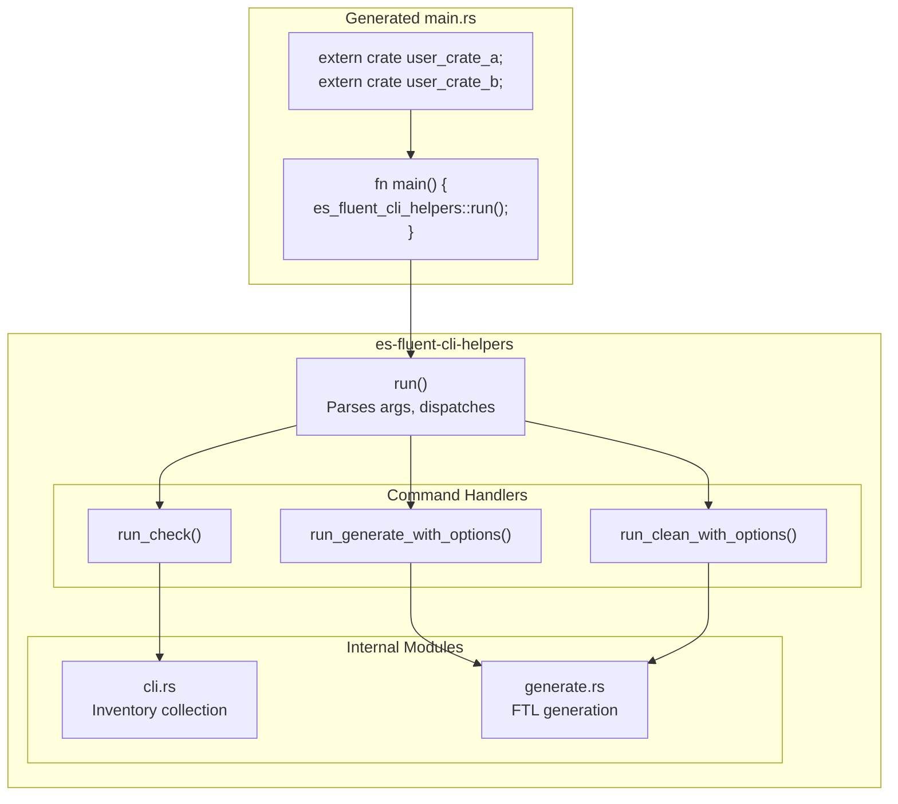
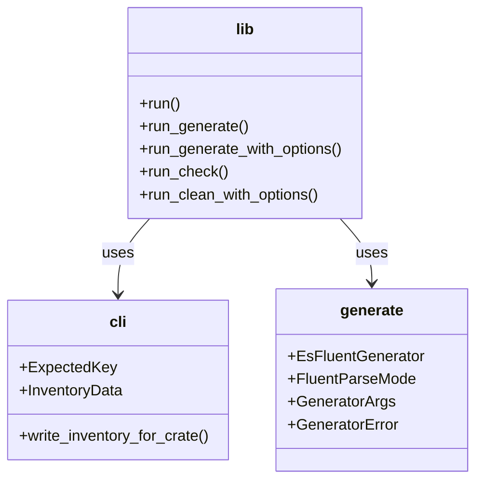
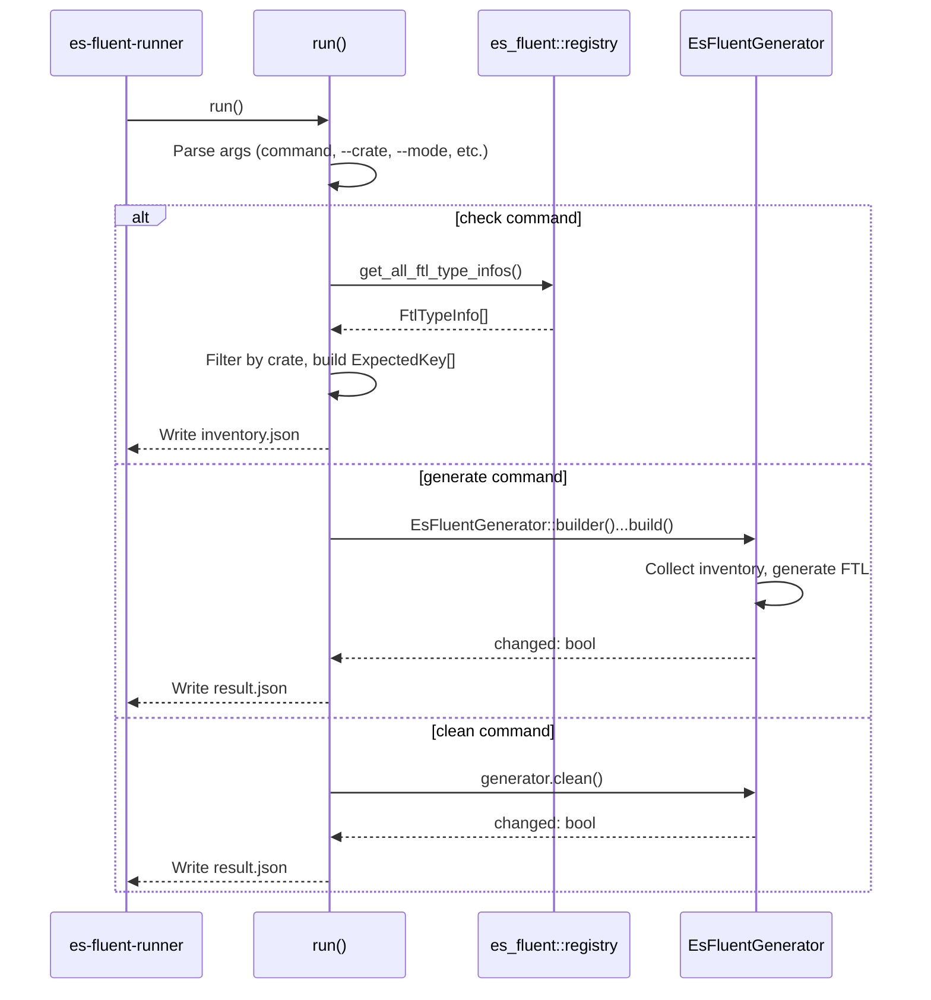

# es-fluent-cli-helpers Architecture

This document explains the role of `es-fluent-cli-helpers` in the `es-fluent` toolchain.

## Purpose

`es-fluent-cli-helpers` is a **runtime helper library** that runs inside the generated runner crate. It minimizes the Rust code needed in Jinja templates by providing well-tested functions for all command handlers.

## Architecture

## Module Structure

## Command Flow

