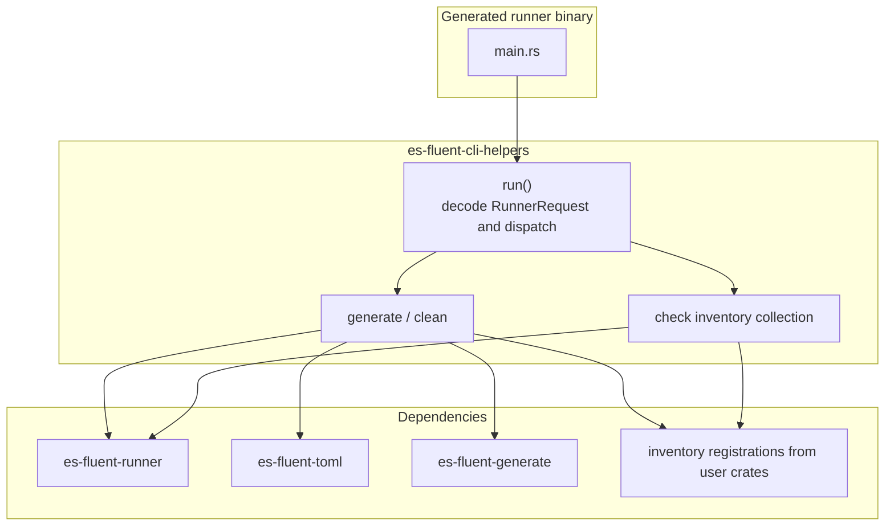
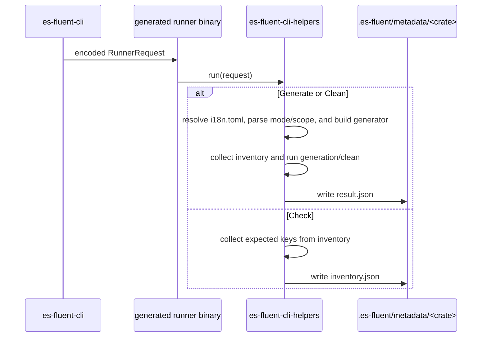

# es-fluent-cli-helpers Architecture

This document explains the role of `es-fluent-cli-helpers` in the `es-fluent`
toolchain.

## Purpose

`es-fluent-cli-helpers` runs inside the generated `.es-fluent/` runner binary.
Its job is to keep the generated `main.rs` tiny while centralizing the runtime
logic for the runner-backed commands:

- `generate`
- `clean`
- `check`

It does not implement the CLI's direct filesystem commands such as `fmt`,
`sync`, or `tree`.

## Architecture

```mermaid
flowchart TD
    subgraph GENERATED["Generated runner binary"]
        MAIN["main.rs"]
    end

    subgraph HELPERS["es-fluent-cli-helpers"]
        RUN["run()<br/>decode RunnerRequest and dispatch"]
        GEN["generate / clean"]
        CHK["check inventory collection"]
    end

    subgraph SUPPORT["Dependencies"]
        RUNNER["es-fluent-runner"]
        TOML["es-fluent-toml"]
        GENERATE["es-fluent-generate"]
        INVENTORY["inventory registrations from user crates"]
    end

    MAIN --> RUN
    RUN --> GEN
    RUN --> CHK
    GEN --> RUNNER
    GEN --> TOML
    GEN --> GENERATE
    GEN --> INVENTORY
    CHK --> RUNNER
    CHK --> INVENTORY
```

## Module Responsibilities

- `lib.rs`: decodes `RunnerRequest`, builds a `RunnerContext`, dispatches the
  requested operation, and writes `result.json`
- `cli.rs`: collects registered message metadata and writes `inventory.json`
- `generate/`: wraps `es-fluent-generate` behind a builder-style API and applies
  namespace validation and config/path resolution

## Command Flow

```mermaid
sequenceDiagram
    participant CLI as es-fluent-cli
    participant Runner as generated runner binary
    participant Helpers as es-fluent-cli-helpers
    participant Meta as .es-fluent/metadata/<crate>

    CLI->>Runner: encoded RunnerRequest
    Runner->>Helpers: run(request)

    alt Generate or Clean
        Helpers->>Helpers: resolve i18n.toml, parse mode/scope, and build generator
        Helpers->>Helpers: collect inventory and run generation/clean
        Helpers->>Meta: write result.json
    else Check
        Helpers->>Helpers: collect expected keys from inventory
        Helpers->>Meta: write inventory.json
    end
```

## Boundary

`es-fluent-cli-helpers` assumes the outer CLI already handled:

- workspace discovery
- runner crate creation
- Cargo invocation and staleness checks
- user-facing reporting and diagnostics formatting
- dry-run diff rendering for direct FTL commands

That orchestration remains in `es-fluent-cli`.
