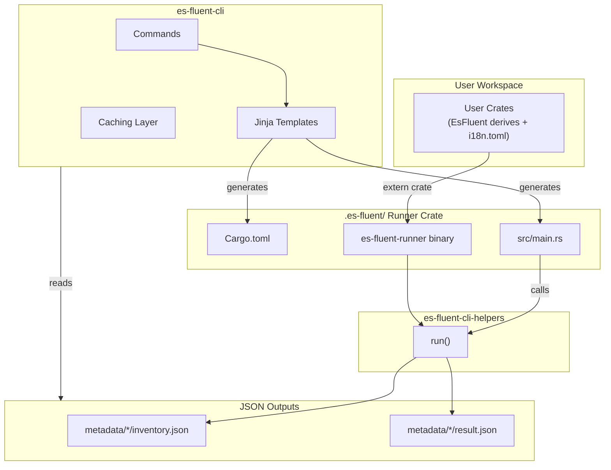
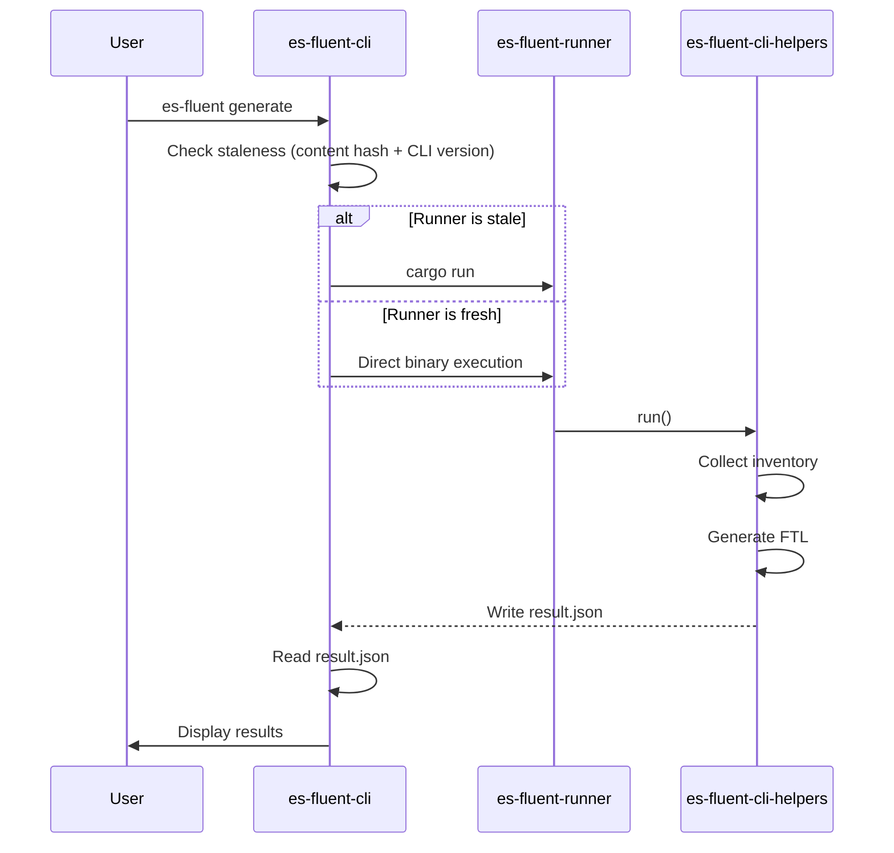
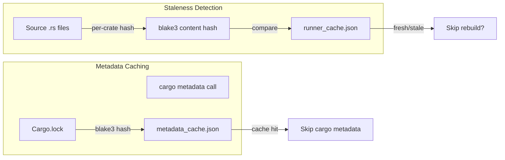

# es-fluent-cli Architecture

This document explains the architecture of `es-fluent-cli` and its relationship with `es-fluent-cli-helpers`.

## Overview

The CLI uses a **runner crate approach** to collect inventory registrations from user code at runtime. The CLI generates a persistent runner crate in `.es-fluent/` that links all workspace crates, then runs a binary that calls into `es-fluent-cli-helpers`.

## Architecture



## Commands

The CLI provides several subcommands, each delegating to `es-fluent-cli-helpers` via the runner crate.

| Command | Goal | Mechanism | Flags |
| :--- | :--- | :--- | :--- |
| `generate` | **Create/Update FTL** | Collects inventory. Merges new keys into existing `.ftl` files using `fluent-syntax`. Preserves comments & formatting. | `--dry-run`, `--force-run` |
| `check` | **Validate Integrity** | Collects inventory. Verifies all keys exist in `.ftl` files. Errors if keys are missing or variables mismatch. | `--all`, `--ignore <CRATE>`, `--force-run` |
| `clean` | **Remove Obsolete** | Collects inventory. Removes keys from `.ftl` files that are no longer present in the Rust code. | `--dry-run` |
| `format` | **Standardize Style** | Parses and re-serializes all `.ftl` files using standard `fluent-syntax` rules to ensure consistent formatting. | `--dry-run`, `--all` (format all locales) |
| `sync` | **Propagate Keys** | Propagates keys from the `fallback_language` (e.g. `en-US`) to other languages, creating empty placeholders for missing translations. | `--locale <LANG>`, `--all` |
| `watch` | **Dev Loop** | Watches `.rs` files for changes. Re-runs `generate` automatically on save. | — |

## Jinja Templates

| Template | Output | Purpose |
|----------|--------|---------|
| `MonolithicCargo.toml.jinja` | `.es-fluent/Cargo.toml` | Dependencies linking all workspace crates |
| `monolithic_main.rs.jinja` | `.es-fluent/src/main.rs` | Entry point calling `es_fluent_cli_helpers::run()` |
| `config.toml.jinja` | `.es-fluent/.cargo/config.toml` | Cargo configuration for runner crate |

## Data Flow



## Version Compatibility

The CLI guarantees version sync at dependency generation time:

- Generated `.es-fluent/Cargo.toml` pins `es-fluent` and `es-fluent-cli-helpers` to the CLI's version
- Runner cache (`runner_cache.json`) stores CLI version for staleness detection
- When CLI version changes, the runner is detected as stale and rebuilt

## Caching



## Deterministic Output

The CLI uses `IndexMap` instead of `HashMap` throughout to ensure deterministic behavior:

- **Cache files** (`runner_cache.json`): Crate hashes are serialized in insertion order, producing stable diffs in version control.
- **Error reporting**: Validation issues are reported in a consistent order across runs.
- **TUI state**: Crate states are maintained in insertion order for predictable display.

This ensures reproducible CI/CD pipelines and cleaner version control diffs.

## Per-Crate Output Structure

```
.es-fluent/
├── Cargo.toml              # Generated from MonolithicCargo.toml.jinja
├── src/main.rs             # Generated from monolithic_main.rs.jinja
├── runner_cache.json       # Maps crate → content hash (for staleness detection)
├── metadata_cache.json     # Cached cargo_metadata results
└── metadata/
    └── {crate_name}/
        ├── inventory.json  # Expected keys + variables (from check)
        └── result.json     # {"changed": bool} (from generate/clean)
```
