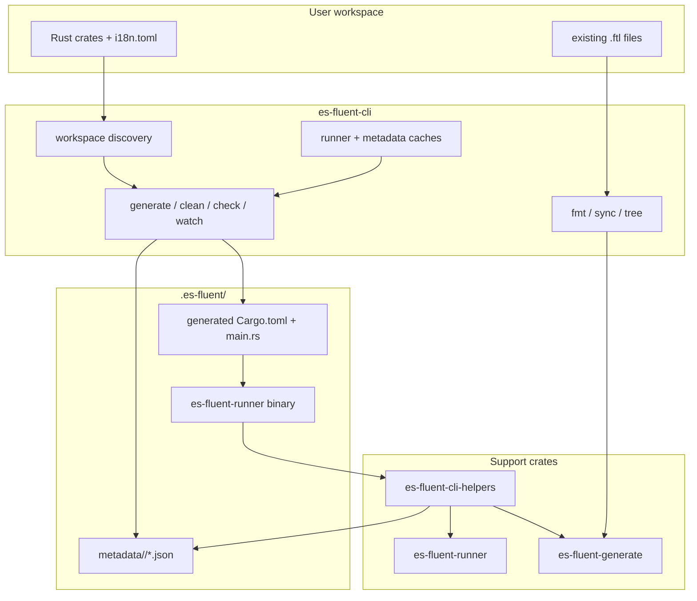
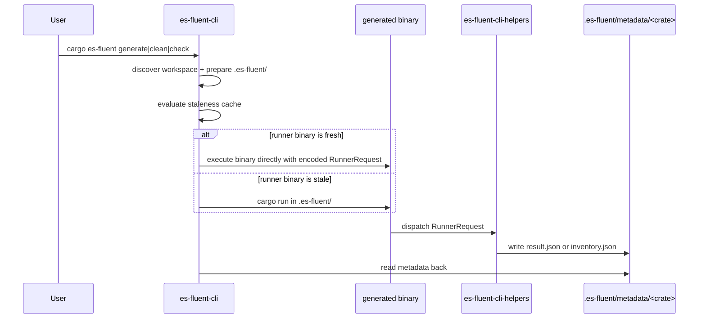

# es-fluent-cli Architecture

This document explains the architecture of `es-fluent-cli` and how it uses the
support crates around it.

## Overview

`es-fluent-cli` has two execution paths:

1. **Runner-backed commands**: `generate`, `clean`, `check`, `status`, and the
   generation loop inside `watch`
1. **Direct FTL commands**: `fmt`, `sync`, `add-locale`, `tree`, and `doctor`

Runner-backed commands need access to inventory registrations emitted by user
crates, so the CLI prepares a monolithic `.es-fluent/` runner workspace and
executes a generated binary that calls into `es-fluent-cli-helpers`. Direct FTL
commands operate only on discovered project files and never invoke the runner.

## High-Level Architecture


```mermaid
flowchart TD
    subgraph USER["User workspace"]
        CODE["Rust crates + i18n.toml"]
        FTL["existing .ftl files"]
    end

    subgraph CLI["es-fluent-cli"]
        DISCOVER["workspace discovery"]
        RUNNERCMDS["generate / clean / check / watch"]
        DIRECT["fmt / sync / tree"]
        CACHE["runner + metadata caches"]
    end

    subgraph RUNNER[".es-fluent/"]
        TEMP["generated Cargo.toml + main.rs"]
        BIN["es-fluent-runner binary"]
        META["metadata/<crate>/*.json"]
    end

    subgraph HELPERS["Support crates"]
        CLIH["es-fluent-cli-helpers"]
        RUNNERPROTO["es-fluent-runner"]
        GENERATE["es-fluent-generate"]
    end

    CODE --> DISCOVER
    FTL --> DIRECT
    DISCOVER --> RUNNERCMDS
    RUNNERCMDS --> TEMP
    TEMP --> BIN
    BIN --> CLIH
    CLIH --> RUNNERPROTO
    CLIH --> GENERATE
    CLIH --> META
    RUNNERCMDS --> META
    DIRECT --> GENERATE
    CACHE --> RUNNERCMDS
```

## Command Paths

| Command      | Inventory needed? | Execution path      | Notes                                                                                         |
| ------------ | ----------------- | ------------------- | --------------------------------------------------------------------------------------------- |
| `generate`   | Yes               | Runner-backed       | Generates or updates fallback-locale FTL files and reads `result.json` for the changed flag   |
| `clean`      | Yes               | Runner-backed       | Uses the same runner workspace and reads `result.json`                                        |
| `check`      | Yes               | Mixed               | Runner collects inventory into `inventory.json`; the CLI then validates `.ftl` files directly |
| `watch`      | Yes               | Runner-backed + TUI | Reuses `generate` requests behind a debounced file watcher                                    |
| `status`     | Yes               | Mixed               | Runs read-only generate/check probes plus direct formatting/sync/orphan probes                |
| `fmt`        | No                | Direct              | Parses existing `.ftl` files and rewrites them with shared formatting logic                   |
| `sync`       | No                | Direct              | Copies missing keys from the fallback locale into target locales                              |
| `add-locale` | No                | Direct              | Creates target locale directories and seeds them via the sync merge path                      |
| `tree`       | No                | Direct              | Parses `.ftl` files and renders a structural tree view                                        |
| `doctor`     | No                | Direct              | Inspects project setup, manager dependencies, locale assets, and build-script tracking        |

## Runner-Backed Flow


```mermaid
sequenceDiagram
    participant User
    participant CLI as es-fluent-cli
    participant Runner as generated binary
    participant Helpers as es-fluent-cli-helpers
    participant Meta as .es-fluent/metadata/<crate>

    User->>CLI: cargo es-fluent generate|clean|check
    CLI->>CLI: discover workspace + prepare .es-fluent/
    CLI->>CLI: evaluate staleness cache
    alt runner binary is fresh
        CLI->>Runner: execute binary directly with encoded RunnerRequest
    else runner binary is stale
        CLI->>Runner: cargo run in .es-fluent/
    end
    Runner->>Helpers: dispatch RunnerRequest
    Helpers->>Meta: write result.json or inventory.json
    CLI->>Meta: read metadata back
```

For `check`, the runner phase only collects the expected keys and variables.
Actual FTL parsing and validation stay in `commands/check/validation/` so the CLI
can produce rich diagnostics without running that logic inside the generated
binary.

`generate` and `watch` pass a `FluentParseMode` through the runner request:
`conservative` preserves existing translations and manual-only entries, while
`aggressive` rebuilds generated output from the current inventory. `generate`,
`clean`, and `check` also expose `--force-run` so callers can bypass the runner
staleness cache when needed.

## Direct FTL Flow

The direct commands stay entirely inside `es-fluent-cli`:

- `fmt` walks crate-local `.ftl` files and uses `es-fluent-generate::formatting`
  to sort and normalize entries, with dry-run diffs produced in the CLI process
- `sync` reads fallback-locale files and fills missing keys in target locales
  only when the caller chooses `--locale` or `--all`; `--create` allows missing
  target locale directories to be created; dry-run mode also prints diffs
  without writing
- `add-locale` is a focused wrapper over `sync --create --locale <LANG>` for
  seeding new target locales from fallback files
- `tree` parses `.ftl` files and renders a terminal tree of messages, terms,
  attributes, and variables
- `doctor` reads manifests and scaffolded files to report setup issues without
  running user code

`check`, `fmt`, `sync`, `tree`, `doctor`, and `status` support
`--output json` for CI and editor integrations. JSON mode suppresses human
headers and progress output so stdout remains machine-readable.

These commands do not depend on inventory and therefore do not need the runner
workspace.

## Generated Runner Workspace

`prepare_monolithic_runner_crate()` creates `.es-fluent/` at the workspace root
with:

- a generated `Cargo.toml` that depends on each workspace library crate
- a generated `src/main.rs` that forwards a serialized request to
  `es-fluent-cli-helpers`
- `.cargo/config.toml` pointing Cargo back at the main workspace `target` dir
- copied `Cargo.lock` and cache files used for staleness detection

The on-disk metadata layout is standardized by `es-fluent-runner`:

```text
.es-fluent/
├── Cargo.toml
├── src/main.rs
├── runner_cache.json
├── metadata_cache.json
└── metadata/
    └── {crate_name}/
        ├── inventory.json
        └── result.json
```

## Caching and Determinism

The CLI keeps the runner fast and reproducible by:

- hashing crate source trees, per-crate `i18n.toml`, and workspace-level
  `Cargo.toml`/`Cargo.lock` inputs for runner staleness
- caching Cargo metadata derived from `Cargo.lock`
- using deterministic iteration order (`IndexMap`) for caches and reports

When the CLI version changes, the runner cache is invalidated and the generated
binary is rebuilt.

Watch mode also tracks the hash each generation started with. If another save
lands while that crate is still generating, the runtime marks it dirty and
immediately queues a follow-up run after the in-flight generation completes.

## Internal Module Split

A few implementation areas are intentionally split into smaller modules:

- `generation/runner/`: runner creation, Cargo execution, and staleness logic
- `commands/check/validation/`: loaded-FTL validation and diagnostic formatting
- `tui/watcher/`: watch-mode event filtering, runtime state, and background
  generation scheduling
- `ftl/`: direct file-discovery and parsing utilities used by `fmt`, `sync`,
  `tree`, and parts of `check`

## Limitations

The runner links workspace crates as **library targets only**. If a crate stores
`#[derive(EsFluent*)]` types exclusively in a binary target, those registrations
will not be visible to runner-backed commands.

Workarounds:

- Add a `lib.rs` target and move the derived types there
- Extract shared localization types into a small library crate
