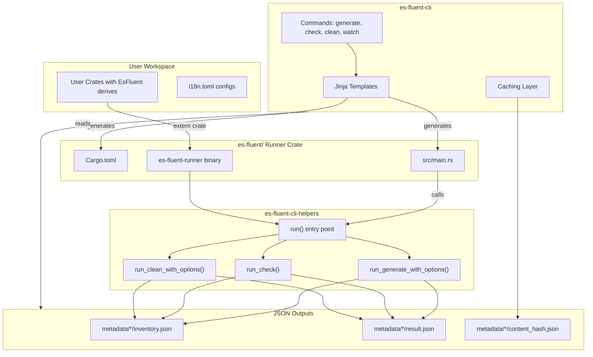
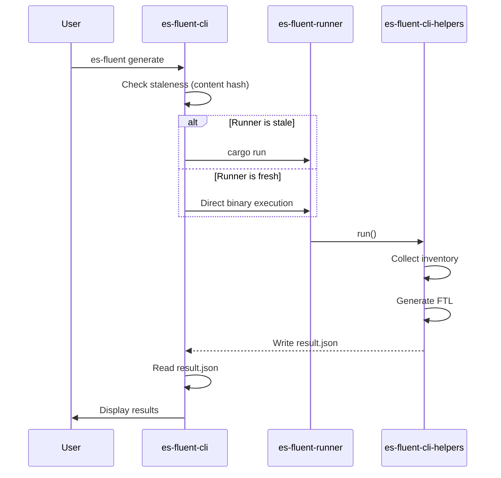
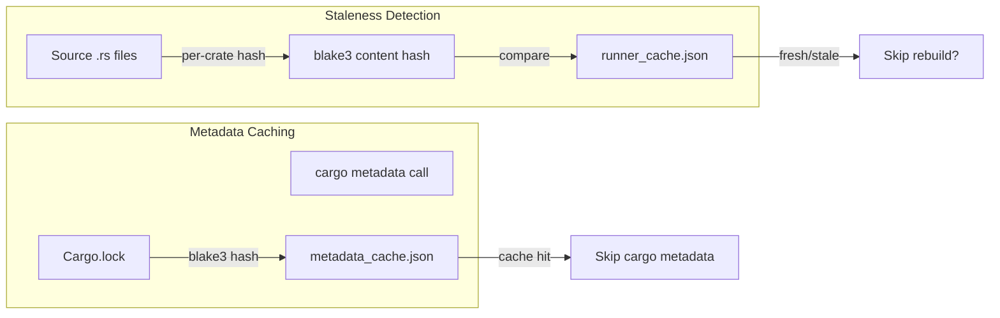

# es-fluent-cli Design

This document explains the architecture of `es-fluent-cli` and its relationship with `es-fluent-cli-helpers`.

## Overview

The CLI uses a **runner crate approach** to collect inventory registrations from user code at runtime. The CLI generates a persistent runner crate in `.es-fluent/` that links all workspace crates, then runs a binary that calls into `es-fluent-cli-helpers`.

## Architecture



## Jinja Templates

| Template | Output | Purpose |
|----------|--------|---------|
| `MonolithicCargo.toml.jinja` | `.es-fluent/Cargo.toml` | Dependencies linking all workspace crates |
| `monolithic_main.rs.jinja` | `.es-fluent/src/main.rs` | Entry point calling `es_fluent_cli_helpers::run()` |
| `config.toml.jinja` | `.es-fluent/.cargo/config.toml` | Cargo configuration for runner crate |

## Data Flow



## Caching



## Per-Crate Output Structure

```
.es-fluent/
├── Cargo.toml              # Generated from MonolithicCargo.toml.jinja
├── src/main.rs             # Generated from monolithic_main.rs.jinja
├── runner_cache.json       # Maps crate → content hash
├── metadata_cache.json     # Cached cargo_metadata results
└── metadata/
    └── {crate_name}/
        ├── inventory.json  # Expected keys + variables (from check)
        ├── result.json     # {"changed": bool} (from generate/clean)
        └── content_hash.json  # Per-crate blake3 hash
```
