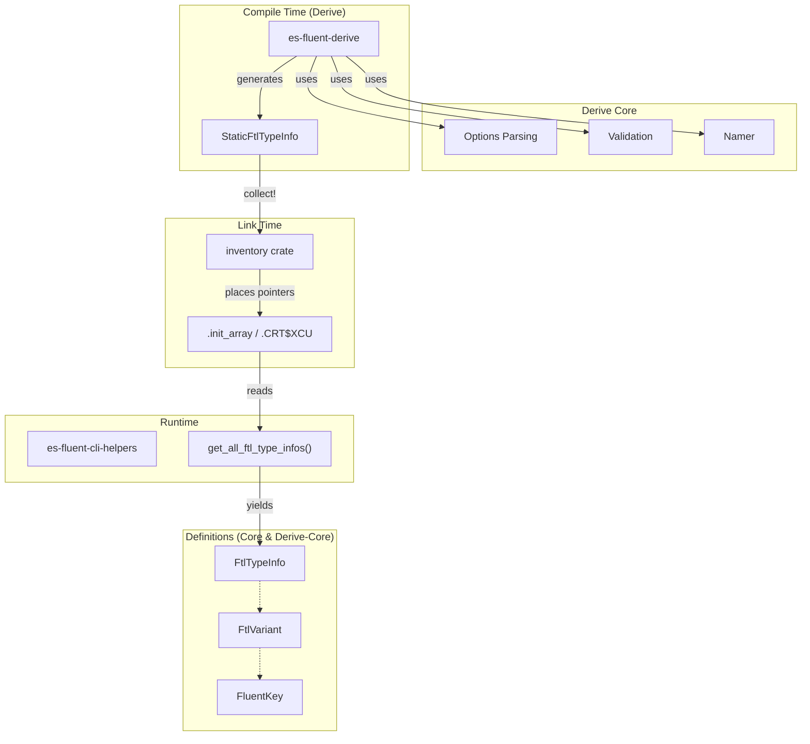

# es-fluent-core Architecture

This document details the architecture of the `es-fluent-core` crate, which serves as the foundational library for the `es-fluent` ecosystem.

## Overview

`es-fluent-core` provides the common type definitions and registration mechanisms required to bridge compile-time Rust type information with runtime localization logic. It is used by:

- **`es-fluent-derive`**: Generated code references types like `StaticFtlTypeInfo` for inventory registration.
- **`es-fluent-cli-helpers`**: Consumes registered type information at runtime for FTL generation.
- **User code**: As a transitive dependency via the generated code.

## Architecture

This crate provides the minimal runtime types required for `inventory` registration and FTL generation.
It works in tandem with **`es-fluent-derive-core`**, which handles build-time logic (parsing, validation).

The `inventory` registration pattern remains central:



## Key Data Structures

### `FtlTypeInfo` & `StaticFtlTypeInfo`

The system uses a "dual-type" approach to support both `const` context construction (required for `inventory`) and easy runtime usage.

| Feature | `StaticFtlTypeInfo` | `FtlTypeInfo` |
|---------|---------------------|---------------|
| Usage | Compile-time registration | Runtime consumption |
| String Type | `&'static str` | `String` |
| Collection | `&'static [T]` | `Vec<T>` |
| Derived Traits | `Clone`, `Debug`, `Eq` | `Serialize`, `Builder` |

## Modules

### `es-fluent-core` (Runtime)

- `registry`: Defines the FTL type structures (`FtlTypeInfo`, etc.) and inventory collection logic.
- `meta`: Low-level type kind metadata (Enum vs Struct).

## Registration Logic

The registry module exposes the mechanism to collect distributed type information.

1. **Registration**:
   Derive macros expand to:

   ```rs
   inventory::submit! {
       &StaticFtlTypeInfo { ... }
   }
   ```

1. **Collection**:
   The runtime (specifically the Runner Crate) calls:

   ```rs
   pub fn get_all_ftl_type_infos() -> Vec<FtlTypeInfo>
   ```

   This function iterates over the `inventory` registry, converts static types to owned types, and returns the full collection.
