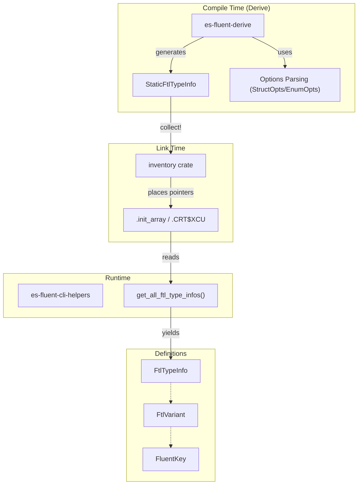

# es-fluent-core Design

This document details the architecture of the `es-fluent-core` crate, which serves as the foundational library for the `es-fluent` ecosystem.

## Overview

`es-fluent-core` provides the common type definitions, traits, and registration mechanisms required to bridge compile-time Rust type information with runtime localization logic. It is shared by:
- `es-fluent-derive`: To generate code that populates these structures.
- `es-fluent-cli-helpers`: To consume the registered type information at runtime for FTL generation.
- User code: As a transient dependency for the generated code.

## Architecture

The core architecture relies on the `inventory` crate to implement a distributed collection pattern. This allows decentralized registration of method/type signatures across multiple crates without a central registry file.



## Key Data Structures

### `FtlTypeInfo` & `StaticFtlTypeInfo`

The system uses a "dual-type" approach to support both `const` context construction (required for `inventory`) and easy runtime usage.

| Feature | `StaticFtlTypeInfo` | `FtlTypeInfo` |
|---------|---------------------|---------------|
| Usage | Compile-time registration | Runtime consumption |
| String Type | `&'static str` | `String` |
| Collection | `&'static [T]` | `Vec<T>` |
| Derived Traits | `Clone`, `Debug`, `Eq` | `Serialize`, `Builder` |


## Modules

-   `registry`: Defines the FTL type structures (`FtlTypeInfo`, etc.) and inventory collection logic.
-   `meta`: Low-level type kind metadata (Enum vs Struct).
-   `namer`: Helpers for correct FTL key naming (`FluentKey`, `FluentDoc`).
-   `options`: Parsed representation of struct and enum attributes, used by the derive macros.
-   `validation`: Logic for validating attribute usage (e.g., ensuring only one default field).
-   `error`: Error types for runtime operations and option parsing.

## Registration Logic

The registry module exposes the mechanism to collect distributed type information.

1.  **Registration**:
    Derive macros expand to:
    ```rust
    inventory::submit! {
        &StaticFtlTypeInfo { ... }
    }
    ```

2.  **Collection**:
    The runtime (specifically the Runner Crate) calls:
    ```rust
    pub fn get_all_ftl_type_infos() -> Vec<FtlTypeInfo>
    ```
    This function iterates over the `inventory` registry, converts static types to owned types, and returns the full collection.
