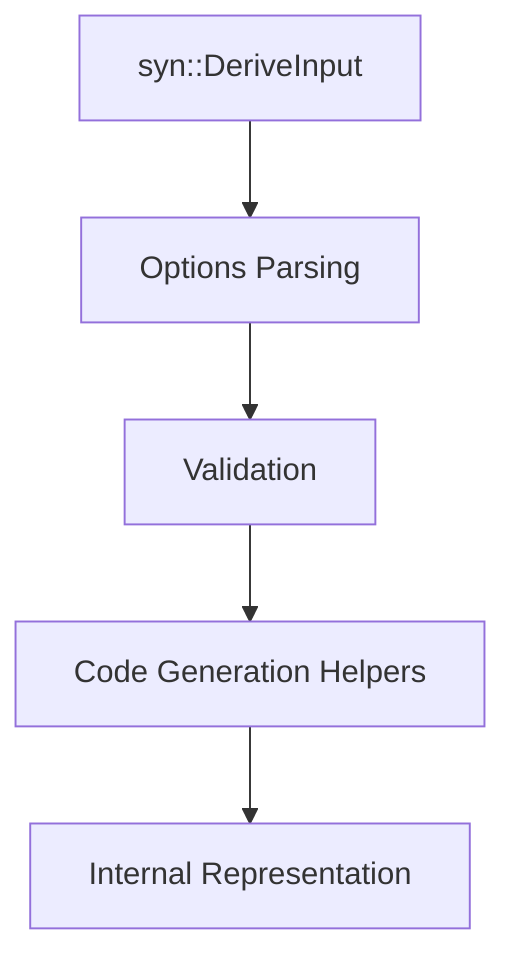

# es-fluent-derive-core Architecture

`es-fluent-derive-core` constitutes the **build-time logic** of the `es-fluent` system. It is designed to be consumed by the procedural macro crate `es-fluent-derive` (and potentially other tooling) to perform heavy lifting such as parsing, validation, and name generation, ultimately producing code that registers with `es-fluent`.

## Purpose

By separating this logic from the `proc-macro` crate (`es-fluent-derive`) and the main facade crate (`es-fluent`), we achieve:

1. **Testability**: Logic in this crate can be unit-tested without the constraints of a `proc-macro` context.
1. **Modularity**: Parsing and validation logic is isolated from code generation.
1. **Performance**: Reduces code bloat in the main runtime crate.

## Architecture Pipeline

The crate implements a transformation pipeline for attribute-driven macro expansion. The flow for a derive macro (like `#[derive(EsFluent)]`) is as follows:

1. **Parsing (`src/options/`)**: The raw `syn` AST is parsed into structured options using `darling`. This step handles attribute extraction (`#[fluent(...)]`) and type conversion.
1. **Validation (`src/validation.rs`)**: The parsed options are checked for semantic correctness (e.g., conflicting flags).
1. **Naming (`src/namer.rs`)**: FTL keys and documentation strings are generated based on the validated options.

## Modules

### 1. Options (`src/options/`)

This module uses `darling` to define the schema for `#[fluent(...)]` attributes. It transforms `syn` types into strictly typed structs.

- **`mod.rs`**: Shared utilities (snake_case validation) and types (`ValueAttr`).
- **`struct.rs`**: Defines `StructOpts`. Handles top-level struct attributes and individual field attributes (`StructFieldOpts`).
- **`enum.rs`**: Defines `EnumOpts`. Handles top-level enum attributes and variant attributes (`EnumVariantOpts`).
- **`choice.rs`**: Options for `#[fluent(choice)]` (nested enums).
- **`namespace.rs`**: Parses `namespace` values for `#[fluent(...)]` and `#[fluent_this(...)]`.
  - Supports literal namespaces (`namespace = "ui"`), file stems (`namespace = file`), and file-relative paths (`namespace(file(relative))`).

**Key Traits:**

- `darling::FromDeriveInput`: Implemented by top-level option structs.
- `darling::FromField` / `darling::FromVariant`: Implemented by child option structs.

### 2. Namer (`src/namer.rs`)

Encapsulates string manipulation logic for FTL keys. It ensures consistent naming conventions across the ecosystem.

- **`FluentKey`**: A type-safe wrapper around `String` for generating key segments.
  - **Kebab-case**: By default, Rust identifiers (`MyStruct`) are converted to kebab-case FTL keys (`my-struct`).
  - **Joining**: Supports joining keys with a delimiter (`-`), e.g., `Enum-Variant`.
  - **"This" Suffix**: Handles `_this` suffix logic for disambiguation.
- **`FluentDoc`**: Generates standardization documentation strings (e.g., `Key = ...`).
- **`UnnamedItem`**: Generates names for tuple fields (`f0`, `f1`).

### 3. Validation (`src/validation.rs`)

Enforces semantic rules that `darling` cannot capture easily. These functions usually take a populated `*Opts` struct and return `syn::Result<()>`.

**Common Checks:**

- **Default Field**: Checks that a struct has at most one field marked `#[fluent(default)]`.
- **Conflict Check**: Ensures a field is not marked both `#[fluent(skip)]` and `#[fluent(default)]`.

### 4. Error (`src/error.rs`)

Centralized error handling types for macro compilation diagnostics.

- **`EsFluentCoreError`**: A custom error enum for derive-macro-specific failures (legacy name from before the crate split).
- **`ErrorExt`**: A trait to attach context (spans, help messages) to errors.
- **Conversion**: Logic to convert internal errors into `syn::Error` for proper compiler diagnostics.
