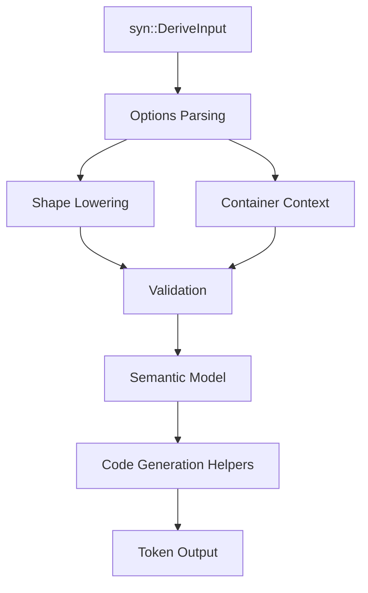

# es-fluent-derive-core Architecture

`es-fluent-derive-core` constitutes the **build-time logic** of the `es-fluent` system. It is designed to be consumed by the procedural macro crate `es-fluent-derive` (and potentially other tooling) to perform heavy lifting such as parsing, validation, and name generation, ultimately producing code that registers with `es-fluent`.

## Purpose

By separating this logic from the `proc-macro` crate (`es-fluent-derive`) and the main facade crate (`es-fluent`), we achieve:

1. **Testability**: Logic in this crate can be unit-tested without the constraints of a `proc-macro` context.
1. **Modularity**: Parsing and validation logic is isolated from code generation.
1. **Performance**: Reduces code bloat in the main runtime crate.

`es-fluent-derive-core` focuses on macro parsing, validation, lowering, and
spanned error values. Runtime-safe metadata lives in `es-fluent-shared`.
It does not abort or emit proc-macro diagnostics directly; `es-fluent-derive`
turns core errors into `compile_error!` tokens at the proc-macro boundary.

## Architecture Pipeline

The crate implements a transformation pipeline for attribute-driven macro expansion. The flow for a derive macro (like `#[derive(EsFluent)]`) is as follows:

```mermaid
flowchart TD
    AST[syn::DeriveInput] --> OPTS[Options Parsing]
    OPTS --> CTX[Container Context]
    OPTS --> LOW[Shape Lowering]
    LOW --> VAL[Validation]
    CTX --> VAL
    VAL --> SEM[Semantic Model]
    SEM --> GEN[Code Generation Helpers]
    GEN --> OUT[Token Output]
```

1. **Attribute Grammar And Context Checking (`src/grammar.rs`,
   `src/attribute.rs`)**: Before `darling` option parsing, derive inputs are
   scanned with a shared attribute-location model. `grammar.rs` owns attribute
   families, keys, accepted locations, accepted-key help text, and the
   `es_fluent_language` mode parser. `attribute.rs` turns those grammar results
   into context-aware diagnostics for derive inputs.
1. **Parsing (`src/options/`)**: The raw `syn` AST is parsed into structured options using `darling`. This step handles attribute extraction (`#[fluent(...)]`) and type conversion.
1. **Container Context (`src/context.rs`)**: Message container identity and
   inherited `#[fluent(...)]` data are captured once from parsed struct or enum
   options. The context carries the source ident, kind, generics, namespace
   with span, and enum domain with span for downstream derives.
1. **Shape Lowering (`src/lowered.rs`)**: Parsed options are converted into
   derive-specific container models that encode the accepted Rust shape and
   reject impossible internal data before token emission.
1. **Validation (`src/validation.rs`)**: Lowered message models are checked for semantic correctness (e.g., conflicting flags).
1. **Semantic Model (`src/semantic.rs`)**: Validated values are wrapped with
   spans and shared newtypes before token emission. Message entries, generated
   enum metadata, choice mappings, derive path lists, domains, namespaces, and
   inventory metadata live here. Rust identifiers needed by codegen are
   preserved as `syn::Ident` rather than being stringified and reconstructed
   later.
1. **Shared Dependencies**: Runtime-safe naming and metadata types come directly from `es-fluent-shared`.

## Modules

### 1. Attribute Grammar And Context (`src/grammar.rs`, `src/attribute.rs`)

The grammar module centralizes the accepted key set and wrong-location help for
user-facing attribute families:

- `#[fluent(...)]` on message containers, fields, and enum variants;
- `#[fluent_variants(...)]` on containers, fields, and enum variants;
- `#[fluent_label(...)]` on label containers;
- `#[fluent(selector)]` selector fields and `#[fluent_choice(...)]` choice containers;
- `#[es_fluent_language(...)]` language enum containers.

The checker accepts only the keys that are meaningful at that location and
reports the grammar-owned accepted key set in the diagnostic help text.
Message containers are split by Rust shape: structs accept only
`namespace = ...`, while enums accept `id`, `domain`, and `namespace`.
Attribute-like macros that do not use `darling` enter through
`macro_input::ValidatedMacroInput`: the language macro uses it for
`mode = "builtin"` / `mode = "custom"` parsing, while manager macros use it for
bare `#[locale]` marker validation. Wrong-key and wrong-shape diagnostics stay
aligned with derive attribute diagnostics.

### 2. Container Context (`src/context.rs`)

`ContainerContext` is the shared source of parent message-container state for
derive expansion. It is built from `StructOpts` or `EnumOpts`, so codegen does
not reparse parent `#[fluent(...)]` attributes to inherit namespace or domain
information.

The context stores:

- the original source ident and Rust container kind;
- cloned generics for emitted impl blocks;
- the container namespace plus the span of the namespace value;
- enum domain overrides as a spanned semantic domain value.

`EsFluent`, `EsFluentLabel`, and `EsFluentVariants` consume this context where
they need inherited container state. `EsFluentChoice` has no parent
`#[fluent(...)]` inheritance path, so it continues to use its choice-specific
options directly.

### 3. Options (`src/options/`)

This module uses `darling` to define the schema for `#[fluent(...)]` attributes. It transforms `syn` types into strictly typed structs.

- **`mod.rs`**: Shared parsing helpers and traits. This module contains the common field/variant/container helper surface (`FluentField`, `VariantFields`, `StructDataOptions`, `EnumDataOptions`, `FilteredEnumDataOptions`, `GeneratedVariantsOptions`, `KeyedVariant`, `Skippable`) plus reusable attribute payload types.
- **`struct.rs`**: Defines `StructOpts`. Handles top-level struct attributes and individual field attributes (`StructFieldOpts`).
- **`enum.rs`**: Defines `EnumOpts`. Handles top-level enum attributes and variant attributes (`EnumVariantOpts`), including enum base ID/domain overrides and variant key overrides.
- **`choice.rs`**: Options for `#[fluent_choice(...)]` enum choices.
- **`label.rs`**: Options for `#[fluent_label(...)]` origin and variants label generation.
- **`lowered.rs`**: Lowered message, generated-variants, label, choice, and
  field models used by code generation to avoid defensive empty collections
  and late internal aborts.
- Namespace parsing stores `es_fluent_shared::namespace::NamespaceRule` in
  `SpannedNamespaceRule`, preserving the span of the literal or keyword value for
  diagnostics. It supports literal namespaces (`namespace = "ui"`), file stems
  (`namespace = file`), file-relative paths (`namespace = file_relative`),
  parent folder names (`namespace = folder`), and relative parent folder paths
  (`namespace = folder_relative`).

**Key Traits:**

- `darling::FromDeriveInput`: Implemented by top-level option structs.
- `darling::FromField` / `darling::FromVariant`: Implemented by child option structs.
- `FluentField`: Shared default behavior for field-level `#[fluent(...)]` parsing.
- `VariantFields`: Shared default behavior for enum-variant field traversal and style checks.
- `StructDataOptions` / `EnumDataOptions` / `FilteredEnumDataOptions`: Shared container traits for struct and enum traversal.
- `GeneratedVariantsOptions`: Shared naming/key helpers for `#[fluent_variants]` containers.
- `KeyedVariant` / `Skippable`: Shared lightweight traits used by validation and codegen to avoid per-wrapper boilerplate.

Field parsing supports `skip`, `arg`, `selector`, explicit `optional`, and
`value` transforms. Validation rejects conflicting field
strategies such as `selector + value`, `optional + value`, `optional + selector`,
or `optional` on skipped fields.
String literal attribute payloads are converted to typed values during option
parsing where they represent Fluent identifiers. Field argument names, variant
key suffixes, enum base IDs, enum lookup domains, generated variant keys,
and literal namespaces retain their source spans as `SpannedValue<T>` or
`SpannedNamespaceRule` and are not reparsed by token emission.
Namespace attributes keep their value span in `SpannedNamespaceRule` while
exposing `NamespaceRule` accessors for code generation and validation.
`#[fluent_variants]` parsing converts `keys = [...]` into typed
`GeneratedKeyName` values immediately, rejecting non-lowercase-snake-case keys
during attribute parsing. It also supports generated enum `derive(...)`,
namespaces, and `#[fluent_variants(skip)]` filtering for fields or enum
variants.
Enum `#[fluent(id = "...")]` values are preserved with the string-literal
span so semantic validation can report invalid base message IDs at the
container attribute.

### 4. Validation (`src/validation.rs`)

Enforces semantic rules that `darling` cannot capture easily. These functions usually take a populated `*Opts` struct and return `syn::Result<()>`.

**Common Checks:**

- **Conflict Check**: Ensures field attributes do not request incompatible
  behavior, such as `skip` with `arg`, `selector` with `value`, `optional`
  with `selector`, `optional` with `value`, or `optional` on skipped fields.
- **Collision Check**: Rejects generated variant keys, Rust idents, and message
  IDs that would collide after defaulting and case conversion.
- **Namespace Check**: Rejects multiple namespace sources that apply to the same
  generated output path instead of relying on implicit precedence.

### 5. Semantic (`src/semantic.rs`)

Holds typed macro IR shared by token emission paths:

- `SpannedValue<T>` for preserving diagnostic spans with parsed values.
- message-id helper functions for deriving typed `FluentMessageId` values from
  source idents, label keys, enum variant keys, and generated variant keys
  before the proc-macro token layer consumes them.
- `MessageModel`, `MessageEntryModel`, and `ArgumentModel` for runtime lookup
  and inventory metadata.
- `ArgumentValueStrategy` and `ValueTransform` for recording how each runtime
  argument value is produced. Explicit `#[fluent(optional)]` is the only source
  of the optional argument strategy; plain `Option<T>` fields remain ordinary
  values unless marked optional. Each value strategy carries the best user-code
  span available, so the proc-macro layer can attach generated conversion code
  to the relevant field or transform expression.
- `GeneratedKeyName` and `GeneratedKeyIdent` for typed generated variant key
  payloads and Rust identifier construction.
- `GeneratedVariantMessageSeed` for generated variant entries before they are
  materialized against each generated enum target.
- `GeneratedEnumModel` and `DerivePathList` for generated unit enums.
- `ChoiceModel` and `ChoiceVariantModel` for `EsFluentChoice` match output.
- Span-aware wrappers around shared Fluent identifier/domain validators.

### 6. Error (`src/error.rs`)

Centralized error handling types for macro compilation diagnostics.

- **`EsFluentCoreError`**: A custom error enum for derive-macro-specific failures.
- **`ErrorExt`**: A trait to attach context (spans, help messages) to errors.
- **Shared Runtime Errors**: `EsFluentError` / `EsFluentResult` are re-exported from `es-fluent-shared`.
