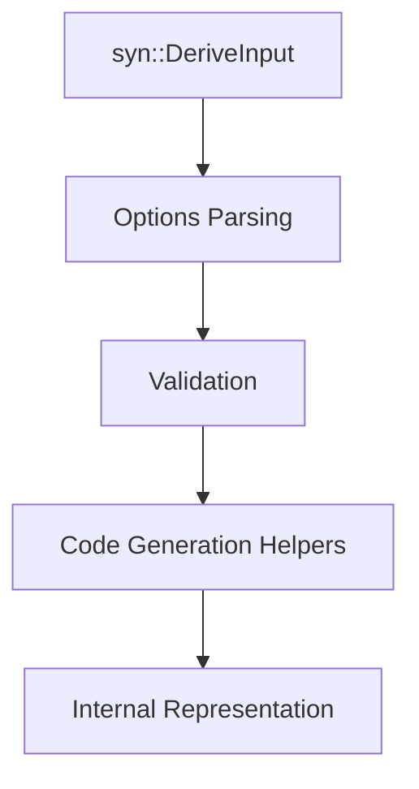

# es-fluent-derive-core Architecture

`es-fluent-derive-core` constitutes the **build-time logic** of the `es-fluent` system. It is designed to be consumed by the procedural macro crate `es-fluent-derive` (and potentially other tooling) to perform heavy lifting such as parsing, validation, and name generation, ultimately producing code that registers with `es-fluent`.

## Purpose

By separating this logic from the `proc-macro` crate (`es-fluent-derive`) and the main facade crate (`es-fluent`), we achieve:

1. **Testability**: Logic in this crate can be unit-tested without the constraints of a `proc-macro` context.
1. **Modularity**: Parsing and validation logic is isolated from code generation.
1. **Performance**: Reduces code bloat in the main runtime crate.

`es-fluent-derive-core` no longer serves as the shared dependency root for runtime-safe metadata. That surface now lives in `es-fluent-shared`, while this crate focuses on macro parsing, validation, and proc-macro diagnostics.

## Architecture Pipeline

The crate implements a transformation pipeline for attribute-driven macro expansion. The flow for a derive macro (like `#[derive(EsFluent)]`) is as follows:

```mermaid
flowchart TD
    AST[syn::DeriveInput] --> OPTS[Options Parsing]
    OPTS --> VAL[Validation]
    VAL --> GEN[Code Generation Helpers]
    GEN --> OUT[Internal Representation]
```

1. **Parsing (`src/options/`)**: The raw `syn` AST is parsed into structured options using `darling`. This step handles attribute extraction (`#[fluent(...)]`) and type conversion.
1. **Validation (`src/validation.rs`)**: The parsed options are checked for semantic correctness (e.g., conflicting flags).
1. **Shared Dependencies**: Runtime-safe naming and metadata types come directly from `es-fluent-shared`; this crate no longer mirrors them through top-level compatibility modules.

## Modules

### 1. Options (`src/options/`)

This module uses `darling` to define the schema for `#[fluent(...)]` attributes. It transforms `syn` types into strictly typed structs.

- **`mod.rs`**: Shared parsing helpers and traits. This now holds the common field/variant/container helper surface (`FluentField`, `VariantFields`, `StructDataOptions`, `EnumDataOptions`, `FilteredEnumDataOptions`, `GeneratedVariantsOptions`, `KeyedVariant`, `Skippable`) plus reusable attribute payload types.
- **`struct.rs`**: Defines `StructOpts`. Handles top-level struct attributes and individual field attributes (`StructFieldOpts`).
- **`enum.rs`**: Defines `EnumOpts`. Handles top-level enum attributes and variant attributes (`EnumVariantOpts`).
- **`choice.rs`**: Options for `#[fluent(choice)]` (nested enums).
- **`namespace.rs`**: Parses `namespace` values from `#[fluent(...)]`.
  - Supports literal namespaces (`namespace = "ui"`), file stems (`namespace = file`), file-relative paths (`namespace(file(relative))`), parent folder names (`namespace = folder`), and relative parent folder paths (`namespace(folder(relative))`).

**Key Traits:**

- `darling::FromDeriveInput`: Implemented by top-level option structs.
- `darling::FromField` / `darling::FromVariant`: Implemented by child option structs.
- `FluentField`: Shared default behavior for field-level `#[fluent(...)]` parsing.
- `VariantFields`: Shared default behavior for enum-variant field traversal and style checks.
- `StructDataOptions` / `EnumDataOptions` / `FilteredEnumDataOptions`: Shared container traits for struct and enum traversal.
- `GeneratedVariantsOptions`: Shared naming/key helpers for `#[fluent_variants]` containers.
- `KeyedVariant` / `Skippable`: Shared lightweight traits used by validation and codegen to avoid per-wrapper boilerplate.

### 2. Validation (`src/validation.rs`)

Enforces semantic rules that `darling` cannot capture easily. These functions usually take a populated `*Opts` struct and return `syn::Result<()>`.

**Common Checks:**

- **Default Field**: Checks that a struct has at most one field marked `#[fluent(default)]`.
- **Conflict Check**: Ensures a field is not marked both `#[fluent(skip)]` and `#[fluent(default)]`.

### 3. Error (`src/error.rs`)

Centralized error handling types for macro compilation diagnostics.

- **`EsFluentCoreError`**: A custom error enum for derive-macro-specific failures.
- **`ErrorExt`**: A trait to attach context (spans, help messages) to errors.
- **Shared Runtime Errors**: `EsFluentError` / `EsFluentResult` are re-exported from `es-fluent-shared`.
