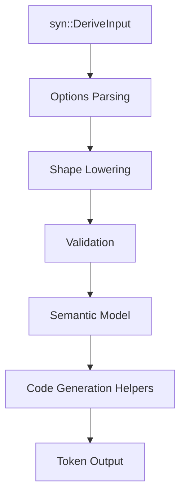

# es-fluent-derive-core Architecture

`es-fluent-derive-core` constitutes the **build-time logic** of the `es-fluent` system. It is designed to be consumed by the procedural macro crate `es-fluent-derive` (and potentially other tooling) to perform heavy lifting such as parsing, validation, and name generation, ultimately producing code that registers with `es-fluent`.

## Purpose

By separating this logic from the `proc-macro` crate (`es-fluent-derive`) and the main facade crate (`es-fluent`), we achieve:

1. **Testability**: Logic in this crate can be unit-tested without the constraints of a `proc-macro` context.
1. **Modularity**: Parsing and validation logic is isolated from code generation.
1. **Performance**: Reduces code bloat in the main runtime crate.

`es-fluent-derive-core` no longer serves as the shared dependency root for runtime-safe metadata. That surface now lives in `es-fluent-shared`, while this crate focuses on macro parsing, validation, and proc-macro diagnostics.

## Architecture Pipeline

The crate implements a transformation pipeline for attribute-driven macro expansion. The flow for a derive macro (like `#[derive(EsFluent)]`) is as follows:

```mermaid
flowchart TD
    AST[syn::DeriveInput] --> OPTS[Options Parsing]
    OPTS --> LOW[Shape Lowering]
    LOW --> VAL[Validation]
    VAL --> SEM[Semantic Model]
    SEM --> GEN[Code Generation Helpers]
    GEN --> OUT[Token Output]
```

1. **Parsing (`src/options/`)**: The raw `syn` AST is parsed into structured options using `darling`. This step handles attribute extraction (`#[fluent(...)]`) and type conversion.
1. **Shape Lowering (`src/lowered.rs`)**: Parsed options are converted into
   derive-specific container models that encode the accepted Rust shape and
   reject impossible internal data before token emission.
1. **Validation (`src/validation.rs`)**: Lowered message models are checked for semantic correctness (e.g., conflicting flags).
1. **Semantic Model (`src/semantic.rs`)**: Validated values are wrapped with spans and shared newtypes before token emission. Message entries, generated enum metadata, choice mappings, derive path lists, domains, namespaces, and inventory policy live here.
1. **Shared Dependencies**: Runtime-safe naming and metadata types come directly from `es-fluent-shared`; this crate uses those shared types instead of defining local mirror types.

## Modules

### 1. Options (`src/options/`)

This module uses `darling` to define the schema for `#[fluent(...)]` attributes. It transforms `syn` types into strictly typed structs.

- **`mod.rs`**: Shared parsing helpers and traits. This now holds the common field/variant/container helper surface (`FluentField`, `VariantFields`, `StructDataOptions`, `EnumDataOptions`, `FilteredEnumDataOptions`, `GeneratedVariantsOptions`, `KeyedVariant`, `Skippable`) plus reusable attribute payload types.
- **`struct.rs`**: Defines `StructOpts`. Handles top-level struct attributes and individual field attributes (`StructFieldOpts`).
- **`enum.rs`**: Defines `EnumOpts`. Handles top-level enum attributes and variant attributes (`EnumVariantOpts`), including enum resource/domain overrides, inventory suppression, and variant key overrides.
- **`choice.rs`**: Options for `#[fluent(choice)]` (nested enums).
- **`label.rs`**: Options for `#[fluent_label(...)]` origin and variants label generation.
- **`lowered.rs`**: Lowered message, generated-variants, label, choice, and
  field models used by code generation to avoid defensive empty collections
  and late internal aborts.
- Namespace parsing stores `es_fluent_shared::namespace::NamespaceRule` in
  `NamespaceSpec`, preserving the span of the literal or keyword value for
  diagnostics. It supports literal namespaces (`namespace = "ui"`), file stems
  (`namespace = file`), file-relative paths (`namespace = file_relative`),
  parent folder names (`namespace = folder`), and relative parent folder paths
  (`namespace = folder_relative`).

**Key Traits:**

- `darling::FromDeriveInput`: Implemented by top-level option structs.
- `darling::FromField` / `darling::FromVariant`: Implemented by child option structs.
- `FluentField`: Shared default behavior for field-level `#[fluent(...)]` parsing.
- `VariantFields`: Shared default behavior for enum-variant field traversal and style checks.
- `StructDataOptions` / `EnumDataOptions` / `FilteredEnumDataOptions`: Shared container traits for struct and enum traversal.
- `GeneratedVariantsOptions`: Shared naming/key helpers for `#[fluent_variants]` containers.
- `KeyedVariant` / `Skippable`: Shared lightweight traits used by validation and codegen to avoid per-wrapper boilerplate.

Field parsing supports `skip`, `arg`, `choice`, and `value` transforms.
Validation rejects combining `choice` and `value` on the same field because
the argument cannot be both a Fluent selector value and a transformed value.
String literal attribute payloads keep their literal span in `SpannedString`,
and expose typed accessors for field argument names, variant key suffixes, enum
resource IDs, and enum lookup domains before code generation consumes them.
Namespace attributes keep their value span in `NamespaceSpec` while exposing
`NamespaceRule` accessors for code generation and validation.
`#[fluent_variants]` parsing converts `keys = [...]` into typed
`GeneratedKeyName` values immediately, rejecting non-lowercase-snake-case keys
during attribute parsing. It also supports generated enum `derive(...)`,
namespaces, and `#[fluent_variants(skip)]` filtering for fields or enum
variants.
Enum `#[fluent(resource = "...")]` values are preserved with the string-literal
span so semantic validation can report invalid base message IDs at the
container attribute.

### 2. Validation (`src/validation.rs`)

Enforces semantic rules that `darling` cannot capture easily. These functions usually take a populated `*Opts` struct and return `syn::Result<()>`.

**Common Checks:**

- **Default Field**: Checks that a struct has at most one field marked `#[fluent(default)]`.
- **Conflict Check**: Ensures field attributes do not request incompatible
  behavior, such as `skip` with `default`, `skip` with `arg`, or `choice` with
  `value`.

### 3. Semantic (`src/semantic.rs`)

Holds typed macro IR shared by token emission paths:

- `SpannedValue<T>` for preserving diagnostic spans with parsed values.
- message-id helper functions for deriving typed `FluentMessageId` values from
  source idents, label keys, enum variant keys, and generated variant keys
  before the proc-macro token layer consumes them.
- `MessageModel`, `MessageEntryModel`, and `ArgumentModel` for runtime lookup
  and inventory metadata.
- `ArgumentValueStrategy` and `ValueTransform` for recording how each runtime
  argument value is produced.
- `GeneratedKeyName` and `GeneratedKeyIdent` for typed generated variant key
  payloads and Rust identifier construction.
- `GeneratedEnumModel` and `DerivePathList` for generated unit enums.
- `ChoiceModel` and `ChoiceVariantModel` for `EsFluentChoice` match output.
- Span-aware wrappers around shared Fluent identifier/domain validators.

### 4. Error (`src/error.rs`)

Centralized error handling types for macro compilation diagnostics.

- **`EsFluentCoreError`**: A custom error enum for derive-macro-specific failures.
- **`ErrorExt`**: A trait to attach context (spans, help messages) to errors.
- **Shared Runtime Errors**: `EsFluentError` / `EsFluentResult` are re-exported from `es-fluent-shared`.
