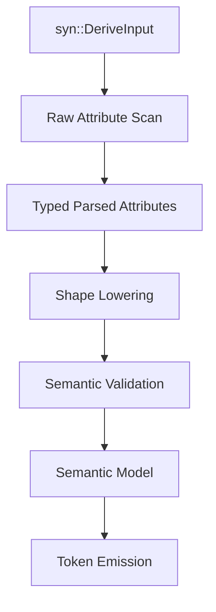

# Typed Attribute IR Rework Plan

This plan covers a breaking internal rework of the `es-fluent` derive pipeline.
The goal is better macro DX by making attribute parsing, validation, semantic
lowering, and token emission stricter and more type-safe.

The project does not need backward or legacy compatibility for old attribute
forms. Prefer rejecting ambiguous syntax over preserving convenience that hides
invariants.

## Goals

1. Make invalid macro input shapes unrepresentable after parsing.
1. Parse user-facing attribute values into typed internal values as early as
   possible.
1. Keep source spans attached to every user-provided value until diagnostics or
   code emission consumes them.
1. Remove silent fallback behavior in internal helpers.
1. Make namespace and generated-key behavior explicit instead of precedence
   driven.
1. Keep generated runtime behavior and inventory metadata derived from the same
   semantic model.

## Non-Goals

1. Do not add new public attribute aliases or compatibility syntax.
1. Do not change the generated FTL key format unless the typed model exposes an
   existing bug.
1. Do not rewrite manager runtime behavior as part of this work.
1. Do not broaden public documentation until the implementation surface is
   stable enough to document accurately.

## Current Problems

### Raw Attribute Values Leak Too Far

Several option accessors still expose raw strings or `syn::LitStr` values before
later code reparses them:

- field argument names,
- variant key suffixes,
- enum resource keys,
- generated variant `keys = [...]`,
- derived namespace values,
- generated message keys.

The code already has shared typed values such as `FluentArgumentName`,
`FluentMessageId`, `FluentVariantKey`, `FluentDomain`, and `ResolvedNamespace`.
The next step is to make those the default representation after parsing, not a
late validation step.

### Internal Shape Checks Are Too Permissive

Helpers such as struct and enum traversal currently return empty collections for
unexpected internal shapes. That makes downstream token emission handle states
that should have been impossible after `darling` parsing.

The pipeline should lower raw `syn`/`darling` shapes into explicit typed models:

- `ParsedStruct`
- `ParsedEnum`
- `ParsedField`
- `ParsedVariant`
- `ParsedGeneratedVariants`
- `ParsedLabel`
- `ParsedChoice`

After this lowering, token emission should not need defensive "internal error"
branches for missing named fields or wrong container kinds.

### Attribute Context Rules Are Duplicated

Wrong-context detection for attributes such as `arg`, `value`, `choice`, and
`default` appears in more than one place. This should become one context-aware
attribute parser that knows the valid keys for each location:

- message container,
- message field,
- enum variant,
- generated-variants container,
- generated-variants field or variant,
- label container,
- choice container,
- language container.

### Namespace Precedence Is Hidden

`#[fluent(namespace = ...)]`, `#[fluent_variants(namespace = ...)]`, and
`#[fluent_label(namespace = ...)]` currently participate in implicit precedence.
That is convenient but surprising.

With no compatibility requirement, prefer a compile error when multiple
namespace sources apply to the same generated item. A user should have exactly
one namespace source for a given output path.

## Proposed Pipeline



### 1. Raw Attribute Scan

Create a small scanner that walks `syn::DeriveInput` once and records every
recognized attribute with:

- attribute name,
- attribute location,
- parsed meta item,
- source span,
- owning container, variant, or field.

The scanner should reject malformed syntax immediately when it can point at the
bad token. It should not know about generated keys or runtime semantics.

### 2. Typed Parsed Attributes

Replace broad `darling` flatten structs with narrower parsed attribute enums.
Example shape:

```rust
pub enum MessageFieldAttr {
    Skip(SpannedValue<ExplicitBool>),
    Default(SpannedValue<ExplicitBool>),
    Choice(SpannedValue<ExplicitBool>),
    Arg(SpannedValue<FluentArgumentName>),
    Value(ValueTransform),
}
```

Rules:

- boolean flags must use one accepted form per attribute family;
- string payloads are validated into shared Fluent newtypes immediately;
- generated variant keys become a dedicated `GeneratedKeyName` type;
- namespace literals become `ResolvedNamespace`;
- dynamic namespace rules stay as a typed rule with a span;
- unsupported keys should produce context-specific diagnostics.

### 3. Shape Lowering

Lower the parsed attributes and `syn` data into container-specific models.
These models should encode the allowed Rust shape:

- `MessageStructModel` supports named, tuple, and unit structs.
- `MessageEnumModel` supports unit, tuple, and named enum variants.
- `GeneratedVariantsStructModel` supports named and unit structs only.
- `GeneratedVariantsEnumModel` supports enum variants only.
- `ChoiceModel` supports unit enum variants only.
- `LabelModel` supports structs and enums only.

If a model requires named fields, store named fields directly instead of
`Option<Ident>`.

### 4. Semantic Validation

Move validation from raw option structs onto lowered models. Validation should
operate on typed values:

- skipped fields cannot also expose arguments or default values;
- argument names are unique after field defaults and overrides;
- variant keys are unique after defaults and overrides;
- generated enum idents are unique;
- namespace sources do not conflict;
- dynamic namespace rules are documented as runtime/CLI-resolved;
- transform and choice strategies are mutually exclusive unless an explicit
  rule says one wins.

Validation should accumulate compatible errors where practical, but a targeted
single error is acceptable when later checks need a valid model.

### 5. Semantic Model

Keep `MessageModel`, `MessageEntryModel`, `ArgumentModel`,
`GeneratedEnumModel`, and `ChoiceModel`, but make them consume only validated
lowered models.

Token emission should receive semantic models that already contain:

- typed message IDs,
- typed domains,
- typed argument names,
- typed namespace rules,
- validated derive paths,
- value strategies,
- inventory policy,
- source locations.

No token-emission helper should need to call `message_id_or_abort` or parse a
Fluent identifier from a raw string.

## Breaking Decisions

Use these decisions unless implementation exposes a better strict option:

1. Reject old or ambiguous namespace forms instead of normalizing them.
1. Reject multiple namespace declarations that apply to the same generated
   output.
1. Reject `#[fluent(choice, value = ...)]` unless a deliberate combined
   strategy is designed.
1. Reject empty generated variant keys during parsed-attribute construction.
1. Prefer explicit `#[fluent(optional)]` over syntax-based `Option<T>`
   detection if the current syntactic detection continues to complicate
   internals.

## Implementation Phases

### Phase 1: Foundation Types

- Add typed parsed-attribute structs and enums in `es-fluent-derive-core`.
- Add `GeneratedKeyName`, `GeneratedKeyIdent`, and any missing source-span
  wrappers.
- Add tests for valid and invalid attribute payload parsing.
- Keep existing macro output unchanged.

Validation:

```sh
cargo test -p es-fluent-derive-core
```

### Phase 2: Context-Aware Attribute Parser

- Add one parser for each attribute context.
- Replace duplicate wrong-context checks with the new parser.
- Ensure unsupported keys produce context-specific errors with help text.
- Snapshot representative diagnostics.

Validation:

```sh
cargo test -p es-fluent-derive-core
cargo test -p es-fluent-derive --test validation_tests
```

### Phase 3: Lowered Container Models

- Introduce lowered models for `EsFluent`, `EsFluentVariants`,
  `EsFluentLabel`, and `EsFluentChoice`.
- Move field and variant traversal helpers behind those models.
- Remove silent empty-vector fallback paths for impossible shapes.
- Remove internal aborts caused by missing named-field idents.

Validation:

```sh
cargo test -p es-fluent-derive-core
cargo test -p es-fluent-derive
```

### Phase 4: Token Emission From Semantic Models

- Change `es-fluent-derive` token helpers to consume semantic models rather
  than raw option structs.
- Remove late `*_or_abort` reparsing where the semantic model already owns a
  typed value.
- Keep runtime and inventory metadata emitted from the same model.
- Update snapshots only where token shape changes intentionally.

Validation:

```sh
cargo test -p es-fluent-derive
cargo test -p es-fluent
```

### Phase 5: Namespace Conflict Rules

- Implement explicit namespace-source conflict detection.
- Add diagnostics for parent/label/variants conflicts.
- Update user-facing docs only if the accepted public behavior changes.

Validation:

```sh
cargo test -p es-fluent-derive-core
cargo test -p es-fluent-derive
cargo test -p es-fluent-cli-helpers
```

### Phase 6: CLI Boundary Tightening

- Keep typed `FluentEntryId` and `FluentArgumentName` through CLI validation
  paths instead of converting inventory keys back into `String`.
- Stringify only in display/error rendering.
- Add tests for invalid inventory JSON and duplicate typed keys.

Validation:

```sh
cargo test -p es-fluent-runner
cargo test -p es-fluent-cli
```

### Phase 7: Manager And Language Macro Alignment

- Apply the same context-aware parser and diagnostic style to
  `es-fluent-lang-macro` and `es-fluent-manager-macros` where relevant.
- Keep manager asset discovery behavior unchanged unless stricter typed values
  expose a bug.

Validation:

```sh
cargo test -p es-fluent-lang-macro
cargo test -p es-fluent-manager-macros
```

## Test Strategy

Use a layered test set:

1. Unit tests for parsed attribute values and rejected syntax.
1. Snapshot tests for compile diagnostics.
1. Snapshot tests for generated tokens.
1. Runtime derive tests in `crates/es-fluent/tests`.
1. CLI inventory and validation tests for typed protocol boundaries.

Prefer `insta` snapshots for diagnostics and generated code. Prefer direct unit
assertions for small typed values like parsed argument names and namespace
rules.

## Documentation Updates

This is mostly internal until accepted public syntax changes. If public behavior
changes, update these together:

1. `examples/readme`
1. root `README.md`
1. affected crate `README.md`
1. relevant `book/src/*.md`
1. `.agents/skills/use-es-fluent/SKILL.md`

If only internals change, update:

1. `crates/es-fluent-derive-core/docs/ARCHITECTURE.md`
1. `crates/es-fluent-derive/docs/ARCHITECTURE.md`

## Completion Criteria

The rework is complete when:

1. generated output comes from semantic models, not raw parsed options;
1. unsupported attribute keys are rejected in the correct context;
1. raw strings no longer cross the parse-to-semantic boundary for Fluent
   identifiers;
1. namespace conflicts are explicit diagnostics;
1. token emission no longer reparses identifiers it already received typed;
1. derive-core, derive, facade derive tests, runner, and CLI validation tests
   pass.

Recommended final validation:

```sh
just test
```
