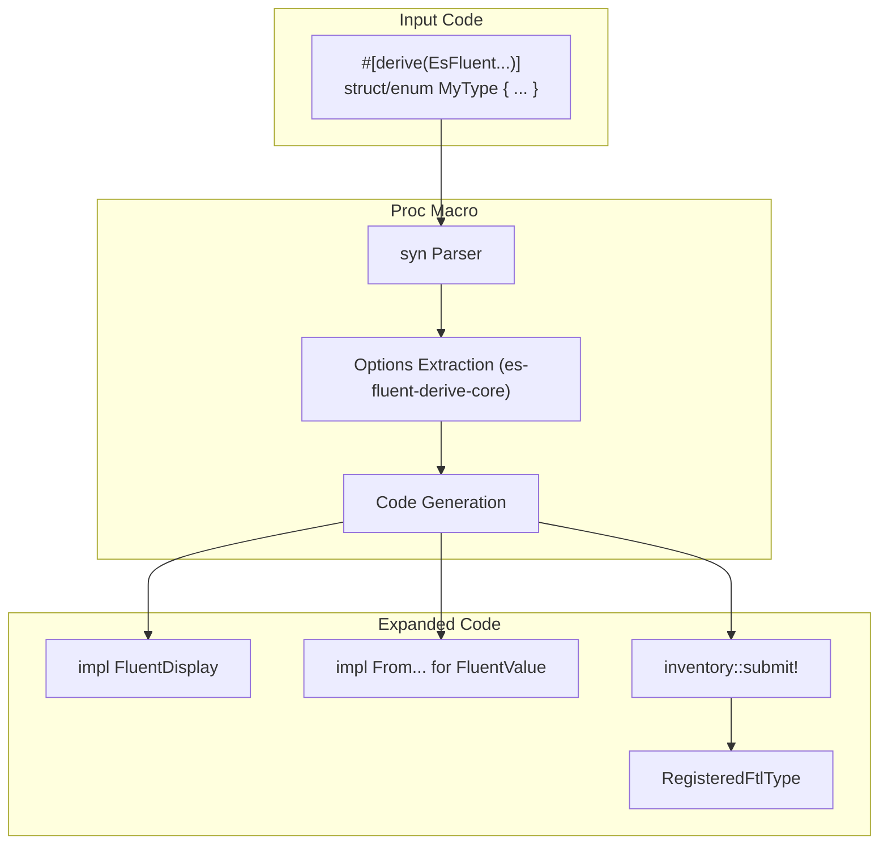

# es-fluent-derive Architecture

This document details the architecture of the `es-fluent-derive` crate, which provides procedural macros for automating the registration of localizable types.

## Overview

`es-fluent-derive` is a procedural macro crate that inspects Rust structs and enums at compile time to:

1. Verify invalid or missing attributes (using `es-fluent-derive-core::options`).
1. Generate `impl FluentDisplay` and `impl FluentValue` implementations for runtime usage.
1. Generate static registration code using `inventory::submit!`.

## Architecture

The crate acts as a compiler plugin that transforms Rust syntax trees into registration boilerplate.

## Key Components

- **`darling`**: Used for declarative attribute parsing (`#[fluent(...)]`).
- **`es-fluent-derive-core::options`**: Defines the target structures (`StructOpts`, `EnumOpts`) that attributes are parsed into.
- **`syn` / `quote`**: Standard tools for parsing and generating Rust code.
- **`es-fluent`**: Provides the runtime target types (`FtlTypeInfo`, `RegisteredFtlType`) that the specific macro generates code for.
- **`es-fluent::__namespace_from_file_path*`**: Internal helpers used when `namespace = file` or `namespace(file(relative))` is specified.

## Macros

All macros are designed to be orthogonal and independent. Code generation for one does not rely on another.

| Macro | Purpose | Code Generation Logic |
| :--- | :--- | :--- |
| `#[derive(EsFluent)]` | **Primary Messaging** | Generates a specific message ID for the struct (or one per enum variant). Implements `FluentDisplay` which calls `localize()` with those IDs. Registers `FtlTypeInfo` to inventory for FTL generation. |
| `#[derive(EsFluentChoice)]` | **Select Expressions** | Does *not* generate a message ID or perform inventory registration. Instead, implements the `EsFluentChoice` trait so the type can be passed as a variable to *other* messages (e.g. `$gender ->`). |
| `#[derive(EsFluentVariants)]` | **Key-Value Pairs** | Generates companion enums (e.g. `MyStructLabelVariants`) where each variant corresponds to a field of the struct. Useful for form labels, placeholders, etc. |
| `#[derive(EsFluentThis)]` | **Self-Referencing** | Implements the `ThisFtl` trait. Registers the type's top-level name as a key (similar to how `EsFluentVariants` registers fields). |

## Namespaces

Derive macros can optionally attach a namespace to each registered `FtlTypeInfo` via:

- `#[fluent(namespace = "ui")]`
- `#[fluent(namespace = file)]` (uses the source file stem, e.g. `src/ui/button.rs` -> `button`)
- `#[fluent(namespace(file(relative)))]` (uses the file path relative to the crate, e.g. `src/ui/button.rs` -> `ui/button`)
- `#[fluent_this(namespace = "...")]` for `EsFluentThis` / `EsFluentVariants`-generated registrations

The namespace value is recorded in `FtlTypeInfo` and later used by the generator to decide which `.ftl` file receives the messages.
