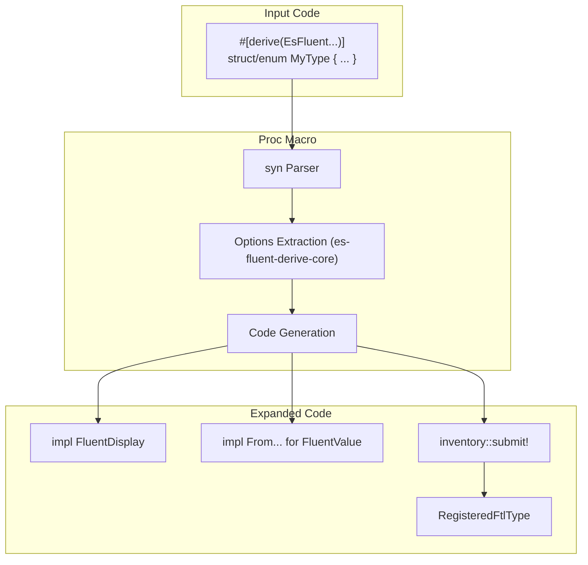

# es-fluent-derive Architecture

This document details the architecture of the `es-fluent-derive` crate, which provides procedural macros for automating the registration of localizable types.

## Overview

`es-fluent-derive` is a procedural macro crate that inspects Rust structs and enums at compile time to:

1. Verify invalid or missing attributes (using `es-fluent-derive-core::options`).
1. Generate `impl FluentDisplay` and `impl From<...> for FluentValue` implementations for runtime usage.
1. Generate static registration code using `inventory::submit!`.

## Architecture

The crate acts as a compiler plugin that transforms Rust syntax trees into registration boilerplate.

```mermaid
flowchart TD
    subgraph INPUT["Input Code"]
        CODE["#[derive(EsFluent...)]<br/>struct/enum MyType { ... }"]
    end

    subgraph MACRO["Proc Macro"]
        PARSE["syn Parser"]
        OPTS["Options Extraction (es-fluent-derive-core)"]
        GEN["Code Generation"]
    end

    subgraph OUTPUT["Expanded Code"]
        IMPL["impl FluentDisplay"]
        VAL["impl From... for FluentValue"]
        INV["inventory::submit!"]
        REG[RegisteredFtlType]
    end

    CODE --> PARSE
    PARSE --> OPTS
    OPTS --> GEN
    GEN --> IMPL
    GEN --> VAL
    GEN --> INV
    INV --> REG
```

## Key Components

- **`darling`**: Used for declarative attribute parsing (`#[fluent(...)]`).
- **`es-fluent-derive-core::options`**: Defines the target structures (`StructOpts`, `EnumOpts`) that attributes are parsed into.
- **`syn` / `quote`**: Standard tools for parsing and generating Rust code.
- **`es-fluent`**: Provides the runtime target types (`FtlTypeInfo`, `RegisteredFtlType`) that the specific macro generates code for.
- **`src/macros/utils.rs`**: Shared proc-macro emission helpers. This now centralizes namespace inheritance/precedence, shared `FluentDisplay` and `FluentMessage` emission, shared `From<...> for FluentValue` emission, and inventory module generation.
- **Namespace rules**: Derive macros record the namespace _rule_ (literal / file / file-relative) in `FtlTypeInfo`; the CLI/generator resolves it at runtime using the type’s `file_path` and the crate manifest directory.

## Macros

All macros are designed to be orthogonal and independent. Code generation for one does not rely on another.

| Macro                         | Purpose                | Code Generation Logic                                                                                                                                                                                                                    |
| :---------------------------- | :--------------------- | :--------------------------------------------------------------------------------------------------------------------------------------------------------------------------------------------------------------------------------------- |
| `#[derive(EsFluent)]`         | **Primary Messaging**  | Generates a specific message ID for the struct (or one per enum variant). Implements `FluentDisplay` for process-global lookup and `FluentMessage` for explicit manager lookup. Registers `FtlTypeInfo` to inventory for FTL generation. |
| `#[derive(EsFluentChoice)]`   | **Select Expressions** | Does _not_ generate a message ID or perform inventory registration. Instead, implements the `EsFluentChoice` trait so the type can be passed as a variable to _other_ messages (e.g. `$gender ->`).                                      |
| `#[derive(EsFluentVariants)]` | **Key-Value Pairs**    | Generates companion enums (e.g. `MyStructLabelVariants`) where each variant corresponds to a field of the struct. Useful for form labels, placeholders, etc.                                                                             |
| `#[derive(EsFluentThis)]`     | **Self-Referencing**   | Implements the `ThisFtl` trait. Registers the type's top-level name as a key (similar to how `EsFluentVariants` registers fields).                                                                                                       |

## Macro Layout

- **`src/macros/derive_es_fluent/`**: Primary derive expansion for structs and enums. The type-specific files now mainly compute localized message bodies and inventory payloads, then delegate common wrapper emission to `utils.rs`.
- **`src/macros/derive_es_fluent_variants/`**: Generated companion-enum expansion for field/variant label sets. Namespace precedence with `#[fluent(...)]` and `#[fluent_this(...)]` is resolved through shared helpers in `utils.rs`, while struct and enum sources now reduce to seed collection plus delegation.
- **`src/macros/derive_es_fluent_this/`**: `ThisFtl` expansion plus optional inventory registration. Parent `#[fluent(namespace = ...)]` inheritance also flows through `utils.rs`.
- **`src/macros/utils.rs`**: Shared token builders and namespace helpers used across the derive entrypoints, including keyed/default fan-out and common generated unit-enum emission for `EsFluentVariants`.
- **`src/macros/ir.rs`**: Small intermediate structs (`LocalizeCallSpec`, `InventoryVariantSpec`, `FluentArgument`, `GeneratedUnitEnumVariant`) used to keep token assembly readable.

## Namespaces

Derive macros can optionally attach a namespace to each registered `FtlTypeInfo` via:

- `#[fluent(namespace = "ui")]`
- `#[fluent(namespace = file)]` (uses the source file stem, e.g. `src/ui/button.rs` -> `button`)
- `#[fluent(namespace(file(relative)))]` (uses the file path relative to the crate, e.g. `src/ui/button.rs` -> `ui/button`)
- `#[fluent(namespace = folder)]` (uses the parent folder name, e.g. `src/ui/button.rs` -> `ui`)
- `#[fluent(namespace(folder(relative)))]` (uses the parent folder path relative to the crate, e.g. `src/ui/button.rs` -> `ui`)

The namespace value is recorded in `FtlTypeInfo` and later used by the generator to decide which `.ftl` file receives the messages.
