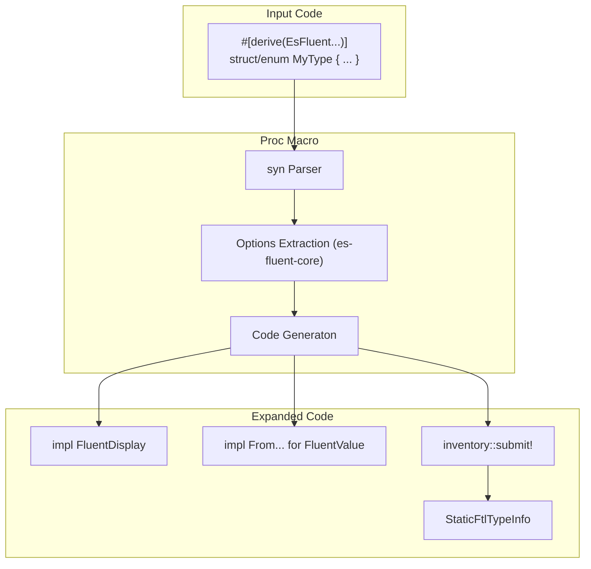

# es-fluent-derive Design

This document details the architecture of the `es-fluent-derive` crate, which provides procedural macros for automating the registration of localizable types.

## Overview

`es-fluent-derive` is a procedural macro crate that inspects Rust structs and enums at compile time to:
1.  Verify invalid or missing attributes (using `es-fluent-core::options`).
2.  Generate `impl FluentDisplay` and `impl FluentValue` implementations for runtime usage.
3.  Generate static registration code using `inventory::submit!`.

## Architecture

The crate acts as a compiler plugin that transforms Rust syntax trees into registration boilerplate.



## Macro Expansion logic

When `#[derive(EsFluent)]` is applied to a struct:

```rust
#[derive(EsFluent)]
#[fluent(message = "my-message")]
struct MyMessage {
    user: String,
}
```

The macro generates roughly:

```rust
// 1. Implementation of formatting traits
impl ::es_fluent::FluentDisplay for MyMessage {
    fn fluent_fmt(&self, f: &mut ::std::fmt::Formatter<'_>) -> ::std::fmt::Result {
        // ... constructs args map ...
        write!(f, "{}", ::es_fluent::localize("my-message", Some(&args)))
    }
}

// 2. Helper for variable passing
impl From<&MyMessage> for ::es_fluent::FluentValue<'_> {
    fn from(value: &MyMessage) -> Self {
       // ...
    }
}

// 3. Inventory Registration (Hidden Module)
#[doc(hidden)]
mod __es_fluent_inventory_my_message {
    use super::*;
    
    // Static data constructed at compile time
    static VARIANTS: &[::es_fluent::__core::registry::StaticFtlVariant] = &[
        ::es_fluent::__core::registry::StaticFtlVariant {
             name: "MyMessage",
             ftl_key: "my-message",
             args: &["user"], 
             module_path: module_path!(),
        }
    ];

    static TYPE_INFO: ::es_fluent::__core::registry::StaticFtlTypeInfo = 
        ::es_fluent::__core::registry::StaticFtlTypeInfo {
            type_kind: ::es_fluent::__core::meta::TypeKind::Struct,
            type_name: "MyMessage",
            variants: VARIANTS,
            file_path: file!(),
            module_path: module_path!(),
        };

    // Submits pointer to .init_array section
    ::es_fluent::__inventory::submit!(&TYPE_INFO);
}
```

## Key Components

-   **`darling`**: Used for declarative attribute parsing (`#[fluent(...)]`).
-   **`es-fluent-core::options`**: Defines the target structures (`StructOpts`, `EnumOpts`) that attributes are parsed into.
-   **`syn` / `quote`**: Standard tools for parsing and generating Rust code.
-   **`es-fluent-core`**: Provides the runtime target types (`StaticFtlTypeInfo`) that the specific macro generates code for.

## Macros

-   `EsFluent`: Primary macro for Structs and Enums. Registers the type as a message or group of messages.
-   `EsFluentKv`: For Key-Value pair generation (serializing fields as FTL attributes).
-   `EsFluentChoice`: For enums that should be serialized as select-matchers rather than separate messages.
-   `EsFluentThis`: Helper for types that bind to specific `_this` convention (self-referencing logic).
