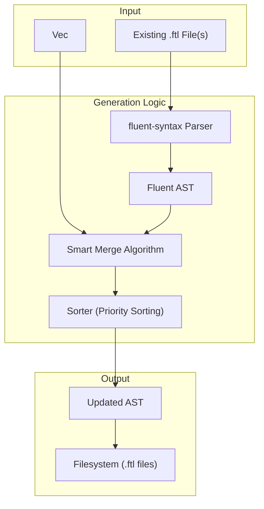

# es-fluent-generate Architecture

This document details the architecture of the `es-fluent-generate` crate, which handles the generation and maintenance of Fluent (`.ftl`) files.

## Overview

`es-fluent-generate` is the backend logic used by `es-fluent-cli-helpers` to physically write translation files. It translates the abstract `FtlTypeInfo` structures into concrete Fluent syntax, while providing sophisticated diffing and merging capabilities to preserve manual edits. When namespaces are present, it splits output into multiple files.

## Architecture

The crate operates on the Fluent Abstract Syntax Tree (AST) provided by the `fluent-syntax` crate, rather than manipulating strings directly.

## Core Features

### Smart Merging

The crate supports two modes of operation (controlled by `FluentParseMode`):

1. **Aggressive**: Completely regenerates the file from the code definitions. Orphaned keys are deleted.
1. **Conservative (Default)**: Merges generated keys into the existing file.
   - Preserves comments and existing message grouping.
   - Updates existing keys if their structure (arguments) changes.
   - Adds new keys.
   - Does **not** remove keys that are present in the file but missing from the code (to support manual-only keys).

### AST Manipulation

By using `fluent-syntax` AST:

- It can inject structural elements like `GroupComment` (e.g., `## GroupName`).
- It ensures syntactically valid FTL output.

### Sorting & Grouping

The generator enforces a specific ordering to keep files readable:

- Messages are grouped by their Rust type name (e.g., all variants of `enum MyErrors` are grouped together).
- Within a group, "special" keys like `_this` (self-referential messages) are prioritized and placed at the top.
- Other keys are sorted alphabetically.

### Namespaced Output

If any `FtlTypeInfo` carries a namespace, items are grouped by that namespace and written to:

- `assets_dir/{locale}/{crate}/{namespace}.ftl` for namespaced types.
- `assets_dir/{locale}/{crate}.ftl` for non-namespaced types (default).

This lets large projects split translations by domain without changing key formats.

### Deterministic Output

The crate uses `IndexMap` instead of `HashMap` for internal data structures to ensure deterministic iteration order. This guarantees that:

- Generated FTL files are reproducible across runs.
- Diffs are clean and predictable when keys are added or modified.
- CI/CD pipelines can reliably detect changes.

## Key Modules

- `formatting`: Logic for sorting (including `_this` priority) and comparing entries.
- `value`: Expansion of placeables and text elements.
- `clean`: Logic for the `clean` command (identifying and removing orphaned keys).
- `error`: Error handling types (`FluentGenerateError`).
- `lib.rs`: Entry point `generate()`.
