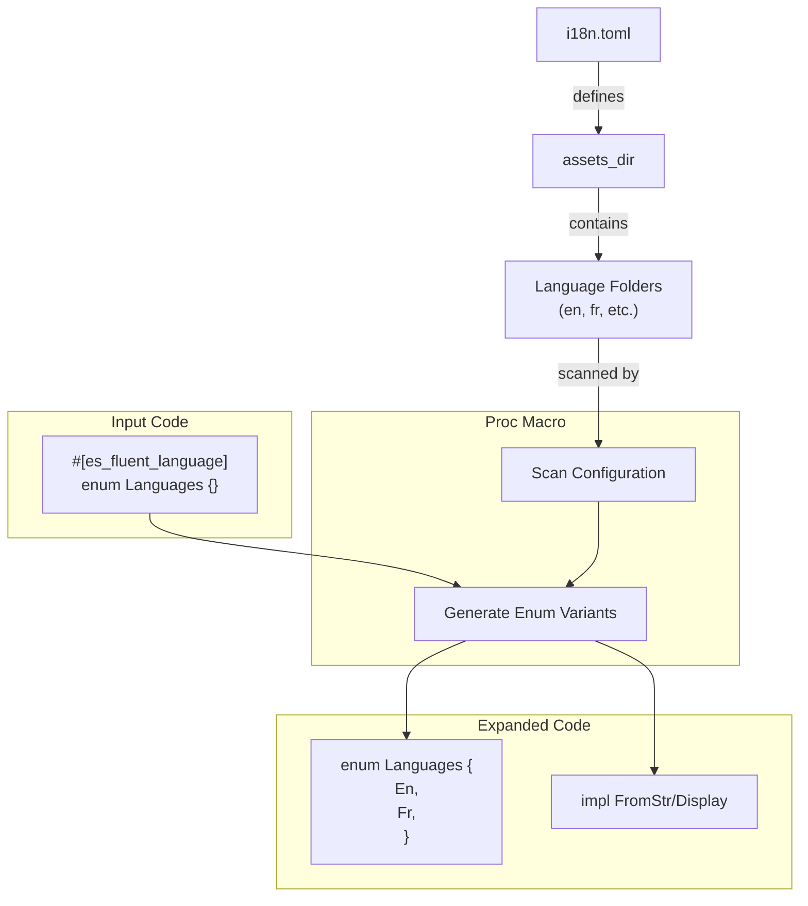

# es-fluent-lang-macro Architecture

This document details the architecture of the `es-fluent-lang-macro` crate, which automates the generation of a type-safe language selection enum.

## Overview

The `#[es_fluent_language]` attribute macro generates a Rust enum representing the supported languages found in the project's configuration (`i18n.toml`) and file structure.

## Architecture



## Macro Process

The macro automates language discovery based on the project structure:

```
workspace_root/
├── i18n.toml          # Specifies: `assets_dir = "assets/locales"`
└── assets/
    └── locales/       # The configured assets directory
        ├── en/        # Found -> Enum Variant: `En`
        ├── fr/        # Found -> Enum Variant: `Fr`
        └── zh-CN/     # Found -> Enum Variant: `ZhCn`
```

The detailed steps are:

1. **Read Configuration**: The macro reads `i18n.toml` from the workspace root (using `es-fluent-toml`) to determine the `assets_dir` and `fallback_language`.
1. **Scan Assets**: It scans the configured assets directory for subdirectories containing `.ftl` files.
1. **Validate Languages**: Each subdirectory name is validated against a list of known BCP-47 language codes (`SUPPORTED_LANGUAGE_KEYS`). Unrecognized language codes will cause a **compile-time error**.
1. **Canonicalize**: Language codes are matched using multiple canonicalization forms (full form, without variants, without region, without script, base language only).
1. **Auto-Insert Fallback**: If the `fallback_language` from `i18n.toml` is not found in the assets directory, it is automatically added to the enum.
1. **Deduplicate**: Languages are sorted alphabetically and deduplicated by their string representation.
1. **Generate Enum**:
   - The user provides an **empty enum**.
   - The macro populates it with variants corresponding to the discovered language codes (converted to PascalCase).
   - Each variant receives a `#[fluent(key = "...")]` attribute with the canonical language code.
   - It implements helper traits for converting between the enum and string representations.
   - It implements `Default` based on the fallback language defined in `i18n.toml`.

## Modes

### Default Mode

By default, the macro links the generated enum to the embedded translations provided by the `es-fluent-lang` crate (e.g., providing "English", "Français" names automatically).

It generates:

```rs
#[es_fluent_language]
pub enum Languages {}
// Becomes ->
#[derive(EsFluent, ...)]
#[fluent(resource = "es-fluent-lang", skip_inventory)]
pub enum Languages {
    En,
    Fr,
    ZhCn, // PascalCase from language code
}
```

- **Expansion**: The empty enum is populated with variants derived from the folder names (converted to PascalCase).
- `resource = "es-fluent-lang"`: Links to the bundled FTL resource.
- `skip_inventory`: Skips registration because these are generic language names, not user-app content.

### Custom Mode (`custom = true`)

If you want to provide your own translations for language names, use the `custom` argument:

```rs
#[es_fluent_language(custom)]
enum Languages {}
```

In this mode:

1. **No Resource Link**: It does *not* add `resource = "es-fluent-lang"`.
1. **Inventory Registration**: It does *not* skip inventory. The enum is registered like any other localized type.
1. **Skeleton Generation**: The CLI will detect this registration and generate skeleton Fluent keys (e.g., `languages-en`, `languages-fr`) in your project's FTL files, which you can then translate manually.
