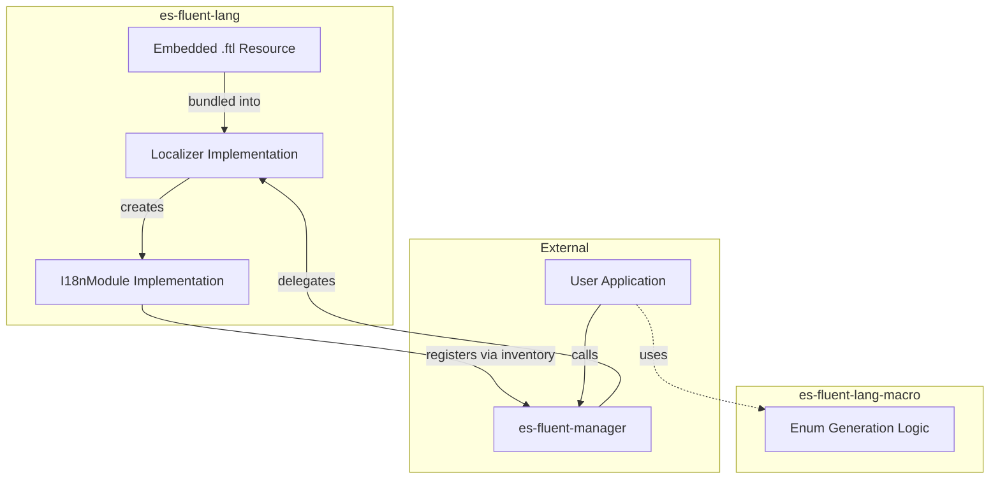

# es-fluent-lang Architecture

This document details the architecture of the `es-fluent-lang` crate, which provides runtime support for language identification and self-localization.

## Overview

`es-fluent-lang` serves two primary purposes:

1. **Type Re-exports**: It re-exports types from `unic-langid` to ensure consistent versions across the ecosystem.
1. **Runtime Module**: It implements a standard `I18nModule` that provides localization for language names (e.g., displaying "English" or "Español" in the UI).
1. **Macro Re-export**: It re-exports the `#[es_fluent_language]` macro from `es-fluent-lang-macro` for convenient usage.

## Architecture



## Features

### Embedded Translations

By default, the crate embeds per-locale translation files under `i18n/<locale>/es-fluent-lang.ftl`, allowing language names to be localized to the current UI language. When the `minimal` feature is enabled, it falls back to the single `es-fluent-lang.ftl` autonym file.

### Manager Integration

It automatically registers itself with `es-fluent-manager-core` using `inventory::submit!`.

```rs
inventory::submit! {
    &EsFluentLanguageModule as &dyn I18nModule
}
```

### Bevy Support

When the optional `bevy` feature is enabled, it registers `StaticI18nResource` entries for each locale found under `i18n/<locale>/es-fluent-lang.ftl`. A small build script scans the `i18n` folder and generates the inventory registrations so Bevy can load the correct language-name resource for each locale.

## Macro

The crate re-exports `#[es_fluent_language]`. For details on how this macro generates the language enum, scans `i18n.toml`, and handles custom modes, please refer to the [es-fluent-lang-macro Architecture Documentation](../../es-fluent-lang-macro/docs/ARCHITECTURE.md).
