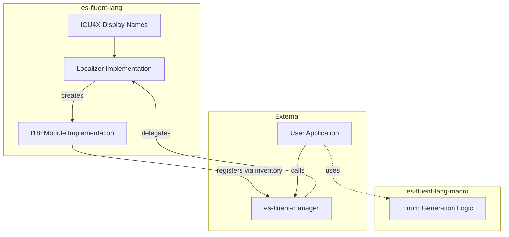

# es-fluent-lang Architecture

This document details the architecture of the `es-fluent-lang` crate, which provides runtime support for language identification and self-localization.

## Overview

`es-fluent-lang` serves two primary purposes:

1. **Type Re-exports**: It re-exports types from `unic-langid` to ensure consistent versions across the ecosystem.
1. **Runtime Module**: It implements a standard `I18nModule` that provides localization for language names (e.g., displaying "English" or "Español" in the UI).
1. **Macro Re-export**: It re-exports the `#[es_fluent_language]` macro from `es-fluent-lang-macro` for convenient usage.

## Architecture


```mermaid
flowchart TD
    subgraph CRATE["es-fluent-lang"]
        ICU["ICU4X Display Names"]
        LOC["Localizer Implementation"]
        MOD["I18nModule Implementation"]
    end

    subgraph MACRO["es-fluent-lang-macro"]
        GEN["Enum Generation Logic"]
    end

    subgraph EXT["External"]
        MGR["es-fluent-manager"]
        APP["User Application"]
    end

    ICU --> LOC
    LOC -->|creates| MOD
    MOD -->|registers via inventory| MGR
    APP -->|calls| MGR
    MGR -->|delegates| LOC
    APP -.->|uses| GEN
```

## Features

### ICU4X-Backed Display Names

The localizer formats language labels directly from ICU4X display-name data at runtime.

By default, it formats autonyms (language names in their own script, such as `français` or `日本語`). When the `localized-langs` feature is enabled, it formats those same language identifiers in the currently selected UI language instead.

The localizer delegates locale fallback to the shared manager-core path, which
uses ICU4X locale fallback data to walk a CLDR-backed parent chain. That means
language-name display locales can resolve parent locales (for example, `zh-CN`
-> `zh`) without treating fallback as a separate best-fit locale negotiation
step.

### Manager Integration

It automatically registers itself with `es-fluent-manager-core` using `inventory::submit!`.

```rs
static ES_FLUENT_LANGUAGE_MODULE: EsFluentLanguageModule = EsFluentLanguageModule;

inventory::submit! {
    &ES_FLUENT_LANGUAGE_MODULE as &dyn I18nModuleRegistration
}
```

### Bevy Support

When the optional `bevy` feature is enabled, it reuses the same standard `I18nModuleRegistration` path as other managers. Bevy fallback localization comes directly from the module localizer.

## Macro

The crate re-exports `#[es_fluent_language]`. For details on how this macro generates the language enum, scans `i18n.toml`, and handles custom modes, please refer to the [es-fluent-lang-macro Architecture Documentation](../../es-fluent-lang-macro/docs/ARCHITECTURE.md).
