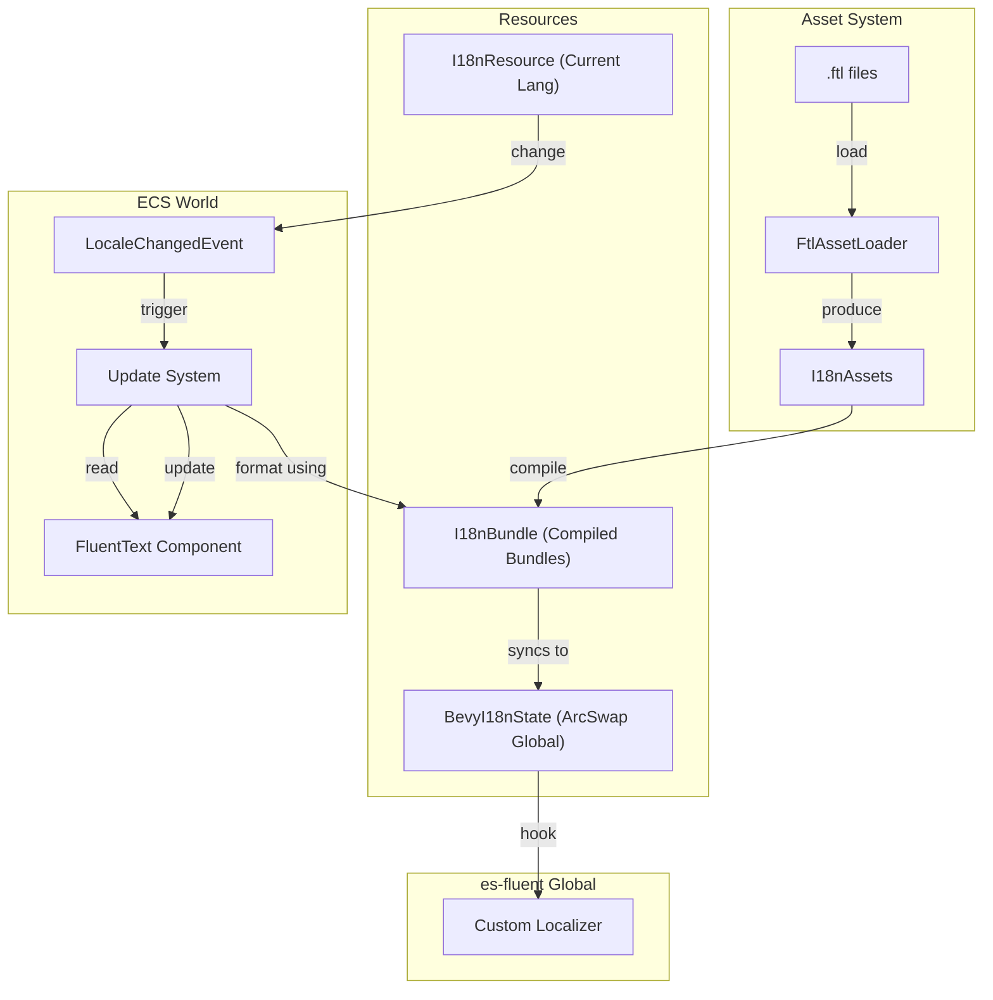

# es-fluent-manager-bevy Architecture

This document details the architecture of the `es-fluent-manager-bevy` crate, which integrates `es-fluent` with the [Bevy](https://github.com/bevyengine/bevy) game engine.

## Overview

`es-fluent-manager-bevy` adapts the localization system to Bevy's ECS (Entity Component System) and asset infrastructure. It supports:

- **Asset Loading**: Loading `.ftl` files via `AssetServer`.
- **Reactivity**: Automatically updating UI text when the language changes.
- **Global Integration**: Seamlessly hooking into `es-fluent`'s global context.
- **Hot Reloading**: Reloading translations when files change on disk.

## Architecture

The system bridges the ECS world with the static global context required by `es-fluent`.



## Key Components

### `I18nPlugin`

The entry point. It registers the `FtlAssetLoader`, resources, and—crucially—installs a **custom localizer** (`es_fluent::set_custom_localizer`). This custom localizer redirects all global `localize!` calls (used by `derive(EsFluent)` types) to the active Bevy resources, allowing standard Rust objects to stringify correctly even inside Bevy systems.

### `BevyI18nState` (Global Mirror)

A global static that mirrors the ECS state for use by the custom localizer. It uses `ArcSwap` for lock-free reads:

```rs
static BEVY_I18N_STATE: OnceLock<ArcSwap<BevyI18nState>> = OnceLock::new();
```

Using `ArcSwap` instead of `Arc<RwLock<...>>` enables lock-free access during localization calls. When the bundle or language changes, a new `BevyI18nState` is atomically swapped in, ensuring the hot path (`localize!` calls) never blocks on a lock.

### `FtlAssetLoader`

Implements `AssetLoader` to parse `.ftl` files into `FtlAsset`s.

### `I18nResource`

Holds the current active language. Setting this triggers the update pipeline.

### `FluentText<T>`

A component wrapper for localizable data.

When `LocaleChangedEvent` fires, the `update_all_fluent_text_on_locale_change` system iterates over all `FluentText` components and re-renders the string data. Additionally, `update_fluent_text_system` handles initial rendering and updates when `FluentText` components are added or modified.

### `define_i18n_module!`

Re-exported from `es-fluent-manager-macros::define_bevy_i18n_module`. See the [es-fluent-manager-macros architecture](../../es-fluent-manager-macros/docs/ARCHITECTURE.md) for details on how the macro discovers languages and generates module data. This macro registers the crate's assets with the system so Bevy knows which domains to load.

## Flow

1. **Startup**: `EsFluentBevyPlugin` initializes resources and registers the global custom localizer.
1. **Loading**: Bevy loads all `.ftl` assets defined by registered modules.
1. **Compilation**: `I18nBundle` creates `FluentBundle`s from loaded assets.
1. **Localization**:
   - **Components**: `FluentText` components update automatically via `update_all_fluent_text_on_locale_change`.
   - **Manual/Macro**: `localize!("my-id")` works anywhere because the global hook calls back into the Bevy state.
