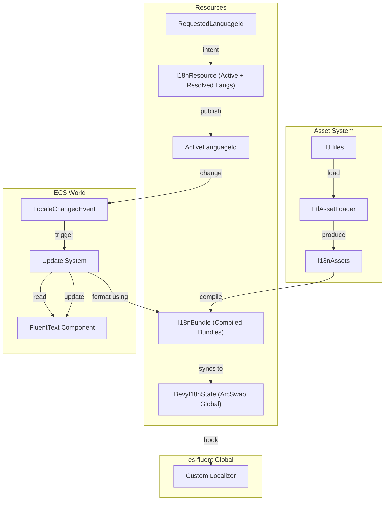

# es-fluent-manager-bevy Architecture

This document details the architecture of the `es-fluent-manager-bevy` crate, which integrates `es-fluent` with the [Bevy](https://github.com/bevyengine/bevy) game engine.

## Overview

`es-fluent-manager-bevy` adapts the localization system to Bevy's ECS (Entity Component System) and asset infrastructure. It supports:

- **Asset Loading**: Loading `.ftl` files via `AssetServer`.
- **Macro-Driven Registration**: `#[derive(BevyFluentText)]` auto-registers components and locale refresh.
- **Reactivity**: Automatically updating UI text when the language changes.
- **Global Integration**: Seamlessly hooking into `es-fluent`'s global context.
- **Hot Reloading**: Reloading translations when files change on disk.

## Architecture

The system bridges the ECS world with the static global context required by `es-fluent`.


```mermaid
flowchart TD
    subgraph ASSETS["Asset System"]
        DISK[".ftl files"]
        LOADER[FtlAssetLoader]
        STORE[I18nAssets]
    end

    subgraph STATE["Resources"]
        RES["I18nResource (Active + Resolved Langs)"]
        REQUESTED["RequestedLanguageId"]
        ACTIVE["ActiveLanguageId"]
        BUNDLE["I18nBundle (Compiled Bundles)"]
        GLOBAL["BevyI18nState (ArcSwap Global)"]
    end

    subgraph ECS["ECS World"]
        COMP["FluentText Component"]
        SYS["Update System"]
        EVENT["LocaleChangedEvent"]
    end

    subgraph GLOBAL_CTX["es-fluent Global"]
        CUSTOM["Custom Localizer"]
    end

    DISK -->|load| LOADER
    LOADER -->|produce| STORE
    STORE -->|compile| BUNDLE

    REQUESTED -->|intent| RES
    RES -->|publish| ACTIVE
    ACTIVE -->|change| EVENT
    EVENT -->|trigger| SYS
    SYS -->|read| COMP
    SYS -->|format using| BUNDLE
    SYS -->|update| COMP

    BUNDLE -->|syncs to| GLOBAL
    GLOBAL -->|hook| CUSTOM
```

## Key Components

### Internal Module Layout

The crate root is now a thin re-export surface. The implementation is split into focused modules:

- `assets.rs`: `FtlAsset`, `FtlAssetLoader`, `I18nAssets`, `I18nBundle`, and `I18nResource`
- `locale.rs`: locale resources/events plus `FromLocale`, `RefreshForLocale`, and the locale-refresh system
- `registration.rs`: `EsFluentBevyPlugin`, inventory registration traits, and `App` extension helpers
- `plugin/setup.rs`: module discovery, initial locale resolution, resource-plan expansion, and app wiring
- `plugin/runtime/assets.rs`: asset-event decoding plus parse/error bookkeeping for loaded FTL resources
- `plugin/runtime/bundles.rs`: dirty-language detection and bundle cache rebuilds
- `plugin/runtime/locale.rs`: locale-change resolution and event emission
- `plugin/runtime/sync.rs`: global bundle mirroring and redraw requests
- `plugin/state.rs`: global mirrored state for the custom localizer

This keeps the crate root declarative and makes the Bevy-facing public API easier to navigate without mixing it with runtime implementation details.

### `I18nPlugin`

The entry point. It registers the `FtlAssetLoader`, resources, and installs a
**custom localizer** for the process-global `es-fluent` hook. The default
`GlobalLocalizerMode::ErrorIfAlreadySet` path uses
`es_fluent::set_custom_localizer_with_domain`, so integration conflicts fail
fast instead of silently replacing an existing owner. `GlobalLocalizerMode::ReplaceExisting`
switches to `es_fluent::replace_custom_localizer_with_domain` for apps that
intentionally want Bevy to take ownership of that hook.

Plugin startup uses the same strict discovery path as
`FluentManager::try_new_with_discovered_modules()`, and the fallback
`FluentManager` is built through that same strict validation flow.

In both modes, the custom localizer redirects hidden global localization
helpers plus domain-scoped `localize_in_domain()` calls (used by
`derive(EsFluent)` types) to the active Bevy resources, allowing standard Rust
objects to stringify correctly even inside Bevy systems.

### `BevyFluentText` (derive macro)

The recommended path for Bevy components. This macro (re-exported from
`es-fluent-manager-macros`) submits a `BevyFluentTextRegistration` via
inventory, and `I18nPlugin` auto-registers those types at startup.

If any fields are marked with `#[locale]`, the macro generates a
`RefreshForLocale` implementation and registers the locale-aware systems
(`register_fluent_text_from_locale`). Otherwise it uses the standard
registration (`register_fluent_text`). This keeps locale-driven fields
(like `Languages` from `es_fluent_lang`) in sync automatically. Locale-aware
refresh uses the originally requested locale, while bundle lookup can still use
a resolved fallback resource locale underneath.

Manual registration via `FluentTextRegistration` remains available for types
that cannot derive the macro.

### `BevyI18nState` (Global Mirror)

A global static that mirrors the ECS state for use by the custom localizer. It uses `ArcSwap` for lock-free reads:

```rs
static BEVY_I18N_STATE: OnceLock<ArcSwap<BevyI18nState>> = OnceLock::new();
```

Using `ArcSwap` instead of `Arc<RwLock<...>>` enables lock-free access during localization calls. When the bundle or language changes, a new `BevyI18nState` is atomically swapped in, ensuring the hot path for derived/localizer lookups never blocks on a lock.

### `FtlAssetLoader`

Implements `AssetLoader` to parse `.ftl` files into `FtlAsset`s.

### `I18nResource`

Holds the currently published active locale plus the resolved ready locale used
for bundle lookup.

### `RequestedLanguageId` and `ActiveLanguageId`

`RequestedLanguageId` tracks the latest locale request immediately.
`ActiveLanguageId` tracks the last locale the plugin actually published for UI
and `LocaleChangedEvent`. This keeps Bevy-facing state explicit: user intent can
move ahead of renderable state while assets are still loading.

### `FluentText<T>`

A component wrapper for localizable data. When registered (typically via
`BevyFluentText`), the update systems keep the rendered string in sync with
the current locale.

When `LocaleChangedEvent` fires, the `update_all_fluent_text_on_locale_change`
system iterates over all `FluentText` components and re-renders the string
data for the published active locale. Additionally, `update_fluent_text_system`
handles initial rendering and updates when `FluentText` components are added or
modified.

### `define_i18n_module!`

Re-exported from `es-fluent-manager-macros::define_bevy_i18n_module`. See the [es-fluent-manager-macros architecture](../../es-fluent-manager-macros/docs/ARCHITECTURE.md) for details on how the macro discovers languages and generates module data. This macro registers the crate's assets with the system so Bevy knows which domains to load.

When namespaces are declared for a domain, namespace files are treated as
required for that locale. The base `{domain}.ftl` file is not part of the
canonical namespaced resource plan.

For macro-generated modules, Bevy uses a compile-time manifest-derived
`resource_plan_for_language` as the authoritative per-locale load plan.
Macro-generated namespaced modules emit only canonical `{domain}/{namespace}.ftl`
entries in that manifest, so stray `{domain}.ftl` base files are not queued for
namespaced locales. Optional entries only exist when a registration explicitly
returns them in its resource plan.

## Flow

1. **Startup**: `I18nPlugin` initializes resources, installs the global custom localizer with fail-fast semantics by default, and auto-registers any `BevyFluentText` types discovered via inventory.
1. **Loading**: Bevy loads all `.ftl` assets defined by registered modules.
1. **Compilation**: `I18nBundle` creates `FluentBundle`s from loaded assets.
1. **Localization**:
   - **Components**: `FluentText<T>` components update automatically via `update_all_fluent_text_on_locale_change`.
   - **Global**: derive-generated lookups and domain-scoped localization calls work because the global hook calls back into the Bevy state.
