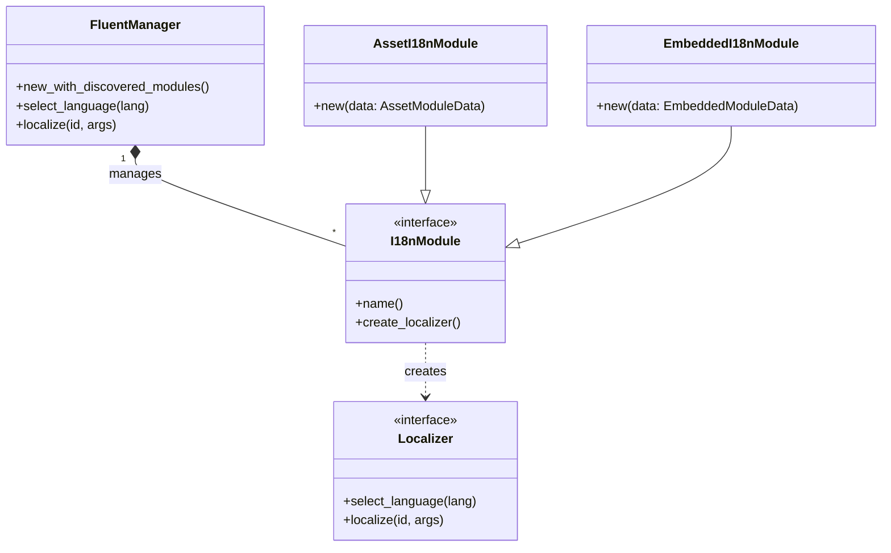

# es-fluent-manager-core Architecture

This document details the architecture of the `es-fluent-manager-core` crate, which defines the fundamental abstractions for the runtime localization system and provides common implementations.

## Overview

`es-fluent-manager-core` defines the traits and types necessary to decouple the _management_ of localization data (how it's loaded and stored) from the _consumption_ of it (how it's used to format strings). It also includes standard implementations for embedded and asset-based workflows.

## Architecture

The system uses a trait-based architecture to allow pluggable backends.

## Key Traits

### `I18nModule`

Represents a source of localization data (e.g., a crate's translations).

- Modules are registered automatically using `inventory`.
- They act as factories for `Localizer`s.

### `Localizer`

Responsible for the actual string formatting logic.

- Holds the loaded `FluentResource`s.
- Wraps `fluent-bundle` logic.

### `EmbeddedAssets`

A trait that provides access to encoded file content for embedded translations.

- Requires implementing `RustEmbed` (typically via `#[derive(RustEmbed)]`).
- The `domain()` method returns the base name for FTL files (e.g., `"my-crate"` for `my-crate.ftl`).

### `I18nAssetModule`

A trait for asset-based (filesystem/Bevy) translation modules.

- Registered via `inventory` for automatic discovery.
- Used by `es-fluent-manager-bevy` for runtime asset loading.

### `StaticI18nResource`

A trait for injecting pre-parsed Fluent resources directly into localization bundles.

- Useful for language-agnostic resources or resources that should be available for all languages.
- Registered via `inventory` for automatic discovery.
- The `matches_language()` method can filter resources by language (defaults to matching all).

## Modules

- `localization`: Core traits (`FluentManager`, `I18nModule`, `Localizer`).
- `embedded_localization`: Implementation for statically embedded assets (`EmbeddedI18nModule`, `EmbeddedAssets`).
- `asset_localization`: Implementation for filesystem/bevy asset loaded assets (`AssetI18nModule`).
- `static_resource`: shared resource types for Bevy or other static contexts.

## Usage

This crate is the common dependency for:

- `es-fluent-manager-embedded` (Wraps `EmbeddedI18nModule` setup).
- `es-fluent-manager-bevy` (Wraps `AssetI18nModule` setup).
