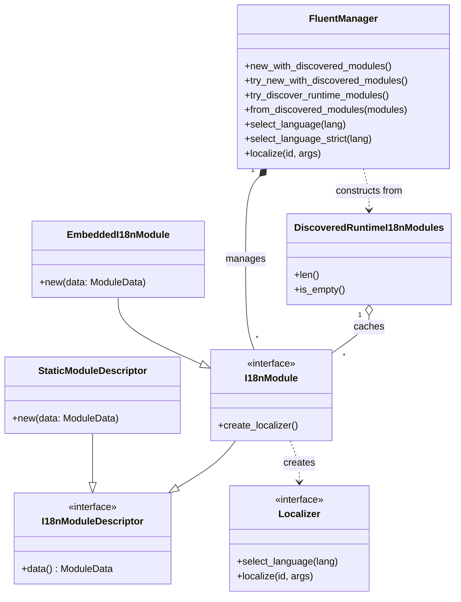

# es-fluent-manager-core Architecture

This document details the architecture of the `es-fluent-manager-core` crate, which defines the fundamental abstractions for the runtime localization system and provides common implementations.

## Overview

`es-fluent-manager-core` defines the traits and types necessary to decouple the _management_ of localization data (how it's loaded and stored) from the _consumption_ of it (how it's used to format strings). It also includes the standard embedded and asset-loading implementations used by concrete managers, including the Dioxus manager's embedded runtime path.

## Architecture

The system uses a trait-based architecture to allow pluggable backends.

```mermaid
classDiagram
    class FluentManager {
        +new_with_discovered_modules()
        +try_new_with_discovered_modules()
        +try_discover_runtime_modules()
        +from_discovered_modules(modules)
        +select_language(lang)
        +select_language_strict(lang)
        +localize(id, args)
    }

    class DiscoveredRuntimeI18nModules {
        +len()
        +is_empty()
    }

    class I18nModuleDescriptor {
        <<interface>>
        +data() ModuleData
    }

    class I18nModule {
        <<interface>>
        +create_localizer()
    }

    class Localizer {
        <<interface>>
        +select_language(lang)
        +localize(id, args)
    }

    class StaticModuleDescriptor {
        +new(data: ModuleData)
    }

    class EmbeddedI18nModule {
        +new(data: ModuleData)
    }

    I18nModule --|> I18nModuleDescriptor
    DiscoveredRuntimeI18nModules "1" o-- "*" I18nModule : caches
    FluentManager "1" *-- "*" I18nModule : manages
    FluentManager ..> DiscoveredRuntimeI18nModules : constructs from
    I18nModule ..> Localizer : creates
    StaticModuleDescriptor --|> I18nModuleDescriptor
    EmbeddedI18nModule --|> I18nModule
```

## Key Traits

### `I18nModule`

Represents a source of localization data (e.g., a crate's translations).

- Modules are registered automatically using `inventory`.
- They act as factories for `Localizer`s.
- They also expose shared metadata via `I18nModuleDescriptor::data()`.

### `I18nModuleDescriptor`

Common metadata contract for manager discovery.

- Returns a shared `ModuleData` shape (`name`, `domain`, languages, namespaces).
- Enables metadata-only registration for managers that don't create `Localizer`s (for example Bevy runtime asset loading).
- Namespace semantics are shared across managers: when `namespaces` is non-empty,
  the namespace list records the module's known split files using canonical
  forward-slash paths like `ui` or `ui/button`, while managers can
  use a more precise per-language resource plan when one is available.

### `I18nModuleRegistration`

Unified inventory contract used by managers.

- Extends `I18nModuleDescriptor` with optional runtime hooks.
- `create_localizer()` supports runtime localization backends.
- `registration_kind()` is explicit metadata, so discovery does not infer
  module kind by constructing a localizer.
- `resource_plan_for_language()` allows compile-time manifest-driven resource plans (used by Bevy to avoid speculative optional asset loads when build-time metadata has exact per-locale resource lists).
- `try_filter_module_registry()` provides the strict discovery path: invalid metadata, duplicate names/domains, and repeated registrations of the same kind for one exact identity become hard errors instead of warnings.
- Successful strict discovery still normalizes one metadata-only registration
  plus one runtime-localizer registration for the same exact identity into a
  single module when their metadata matches exactly.

### `Localizer`

Responsible for the actual string formatting logic.

- Holds the loaded `FluentResource`s.
- Wraps `fluent-bundle` logic.
- Locale negotiation is centralized in the shared fallback helpers, which use
  ICU4X locale fallback data to build a CLDR-backed parent chain and pick the
  first populated locale instead of hand-rolled subtag stripping.
- `FluentManager::select_language()` is best-effort for unsupported locales:
  modules that reject a locale with `LanguageNotSupported` are skipped as long
  as at least one module accepts it.
- `FluentManager::select_language_strict()` preserves transactional switching
  when callers need all modules to agree.
- `FluentManager::try_discover_runtime_modules()` returns
  `DiscoveredRuntimeI18nModules`, allowing integrations such as request-scoped
  SSR to cache strict inventory validation and create fresh managers from the
  cached runtime-capable module list. Metadata-only registrations are validated
  during discovery but skipped for this runtime manager cache.
- `EmbeddedLocalizer::select_language()` now rejects bundle-add conflicts (for
  example duplicate message IDs across loaded files) and keeps the previous
  ready locale active on failure.
- Embedded locale/resource discovery only accepts canonical locale directory
  names, so compile-time discovery and runtime lookup use the same path keys.

### `EmbeddedAssets`

A trait that provides access to encoded file content for embedded translations.

- Requires implementing `RustEmbed` (typically via `#[derive(RustEmbed)]`).
- The `domain()` method returns the base name for FTL files (e.g., `"my-crate"` for `my-crate.ftl`).

### `StaticModuleDescriptor`

Simple wrapper used for metadata-only registrations.

- Registered via `inventory` as `I18nModuleRegistration`.
- Used by `es-fluent-manager-bevy` for runtime asset loading.

## Modules

- `localization`: Core traits (`FluentManager`, `I18nModule`, `Localizer`).
- `embedded_localization`: Implementation for statically embedded assets (`EmbeddedI18nModule`, `EmbeddedAssets`) used by embedded and Dioxus managers.
- `asset_localization`: Shared module metadata contracts (`ModuleData`, `I18nModuleDescriptor`, `StaticModuleDescriptor`).

## Usage

This crate is the common dependency for:

- `es-fluent-manager-embedded` (Wraps `EmbeddedI18nModule` setup).
- `es-fluent-manager-dioxus` (Uses embedded runtime modules for client context and request-scoped SSR managers).
- `es-fluent-manager-bevy` (Wraps `I18nModuleRegistration` setup).
