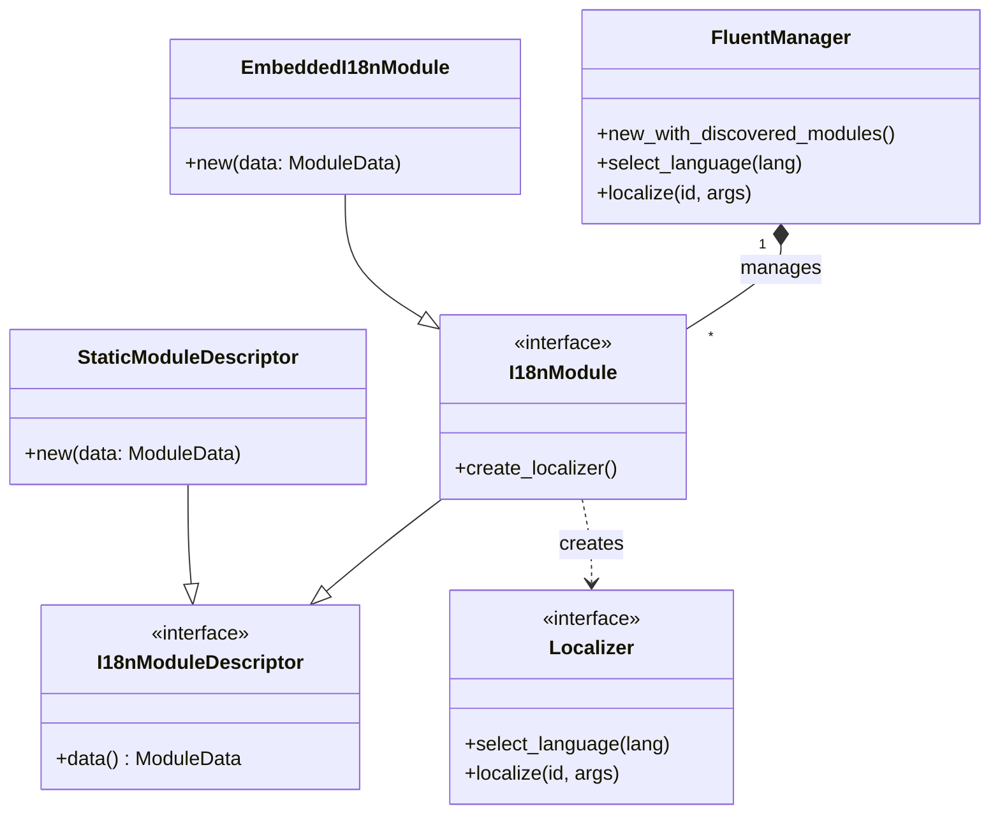

# es-fluent-manager-core Architecture

This document details the architecture of the `es-fluent-manager-core` crate, which defines the fundamental abstractions for the runtime localization system and provides common implementations.

## Overview

`es-fluent-manager-core` defines the traits and types necessary to decouple the _management_ of localization data (how it's loaded and stored) from the _consumption_ of it (how it's used to format strings). It also includes standard implementations for embedded and asset-based workflows.

## Architecture

The system uses a trait-based architecture to allow pluggable backends.

```mermaid
classDiagram
    class FluentManager {
        +new_with_discovered_modules()
        +select_language(lang)
        +localize(id, args)
    }

    class I18nModuleDescriptor {
        <<interface>>
        +data() ModuleData
    }

    class I18nModule {
        <<interface>>
        +create_localizer()
    }

    class Localizer {
        <<interface>>
        +select_language(lang)
        +localize(id, args)
    }

    class StaticModuleDescriptor {
        +new(data: ModuleData)
    }

    class EmbeddedI18nModule {
        +new(data: ModuleData)
    }

    I18nModule --|> I18nModuleDescriptor
    FluentManager "1" *-- "*" I18nModule : manages
    I18nModule ..> Localizer : creates
    StaticModuleDescriptor --|> I18nModuleDescriptor
    EmbeddedI18nModule --|> I18nModule
```

## Key Traits

### `I18nModule`

Represents a source of localization data (e.g., a crate's translations).

- Modules are registered automatically using `inventory`.
- They act as factories for `Localizer`s.
- They also expose shared metadata via `I18nModuleDescriptor::data()`.

### `I18nModuleDescriptor`

Common metadata contract for manager discovery.

- Returns a shared `ModuleData` shape (`name`, `domain`, languages, namespaces).
- Enables metadata-only registration for managers that don't create `Localizer`s (for example Bevy runtime asset loading).
- Namespace semantics are shared across managers: when `namespaces` is non-empty,
  namespace files are required for readiness while `{domain}.ftl` remains
  optional compatibility data.

### `Localizer`

Responsible for the actual string formatting logic.

- Holds the loaded `FluentResource`s.
- Wraps `fluent-bundle` logic.

### `EmbeddedAssets`

A trait that provides access to encoded file content for embedded translations.

- Requires implementing `RustEmbed` (typically via `#[derive(RustEmbed)]`).
- The `domain()` method returns the base name for FTL files (e.g., `"my-crate"` for `my-crate.ftl`).

### `StaticModuleDescriptor`

Simple wrapper used for metadata-only registrations.

- Registered via `inventory` as `I18nModuleRegistration`.
- Used by `es-fluent-manager-bevy` for runtime asset loading.

## Modules

- `localization`: Core traits (`FluentManager`, `I18nModule`, `Localizer`).
- `embedded_localization`: Implementation for statically embedded assets (`EmbeddedI18nModule`, `EmbeddedAssets`).
- `asset_localization`: Shared module metadata contracts (`ModuleData`, `I18nModuleDescriptor`, `StaticModuleDescriptor`).

## Usage

This crate is the common dependency for:

- `es-fluent-manager-embedded` (Wraps `EmbeddedI18nModule` setup).
- `es-fluent-manager-bevy` (Wraps `StaticModuleDescriptor` setup).
