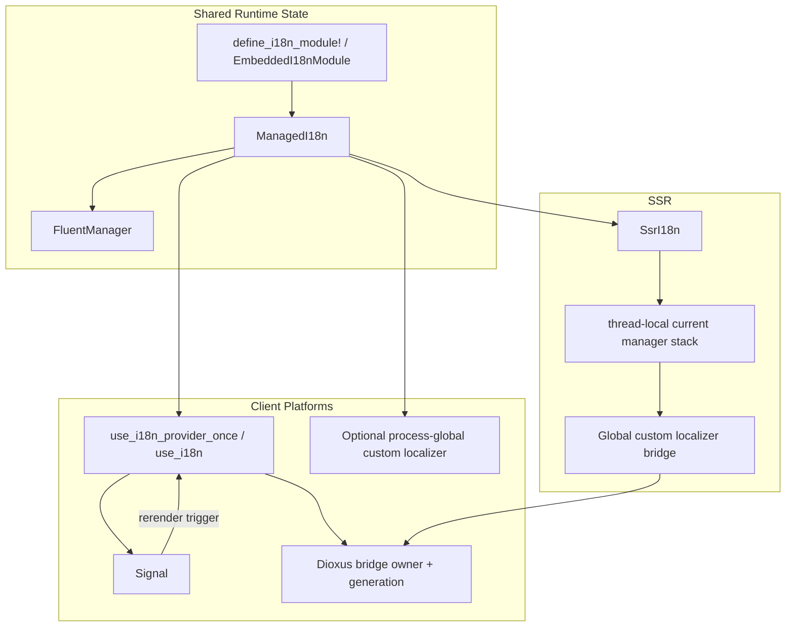

# es-fluent-manager-dioxus Architecture

This document details the architecture of the `es-fluent-manager-dioxus` crate,
which integrates `es-fluent` with Dioxus 0.7.

## Overview

The crate is split by rendering model instead of pretending every Dioxus target
has identical runtime needs:

- `client`, `web`, `desktop`, and `mobile` share a client runtime built around
  embedded assets, a Dioxus hook/context bridge, and an optional process-global
  `es-fluent` custom localizer.
- `desktop` and `mobile` intentionally share the same client implementation
  because Dioxus 0.7 routes both through `dioxus-desktop`.
- `ssr` is separate and uses a request-scoped thread-local bridge around
  synchronous `dioxus::ssr` rendering instead of a long-lived client signal.

Within this workspace, the implementation depends on the same 0.7
`dioxus-core`/`dioxus-hooks`/`dioxus-signals`/`dioxus-ssr` subcrates that sit
under Dioxus 0.7, instead of depending on the `dioxus` umbrella crate directly.
That avoids the current workspace resolver conflict between `dioxus-desktop`'s
`cocoa ^0.26.1` requirement and the existing GPUI pin to `cocoa =0.26.0`.

## Architecture

## Key Pieces

### `ManagedI18n`

This is the framework-agnostic state holder.

- Builds a strict `FluentManager` from discovered modules.
- Selects the requested UI language.
- Exposes direct message lookup helpers.
- Under the `client` renderer feature, can install the process-global
  `es-fluent` custom localizer bridge through
  `install_client_global_bridge(...)`.

Language selection through `select_language(...)` uses the core manager's
best-effort policy: if at least one module accepts a locale, modules that report
`LanguageNotSupported` are skipped. `requested_language()` therefore records the
requested UI language, not a guarantee that every module can localize in that
language. `select_language_strict(...)` exposes the core strict policy for code
that requires all modules to accept the same locale.

The string-returning lookup helpers are rendering-oriented and fall back to the
message id on misses. `try_localize(...)` and `try_localize_in_domain(...)`
preserve the core manager's `Option<String>` result for strict callers and
tests.

`raw_manager_untracked()` intentionally exposes the underlying
`Arc<FluentManager>` as an escape hatch. It is not part of the tracked language
path: direct calls to `FluentManager::select_language(...)` can change lookup
results without updating `ManagedI18n::requested_language()` or a Dioxus signal.

### Client Hook Bridge

The `client`, `web`, `desktop`, and `mobile` surfaces all reuse the same
hook-based runtime:

- `use_i18n_provider_once(...)` builds `ManagedI18n`, optionally installs the
  custom localizer, and provides a generic Dioxus reactive context around it.
- `use_provide_i18n_once(...)` accepts a prebuilt `ManagedI18n` as a first-render
  value; later prop replacement is ignored by design.
- `try_use_i18n()` exposes optional context access, while `use_i18n()` keeps the
  fail-fast path for components that require a provider.
- The client runtime uses one reusable internal pattern: a context value that
  stores framework state plus a tracked `Signal` snapshot derived from that
  state.
- `DioxusI18n` is a thin wrapper over that generic reactive context, with the
  requested locale mirrored into a Dioxus `Signal` so render code can subscribe
  to locale changes.
- `GlobalBridgeLocalizationExt::localize_via_global(...)` and
  `use_global_bridge_localized(...)` intentionally read that signal before
  delegating to the process-global `es-fluent` `ToFluentString` path. These
  helpers are reactive but not context-bound after an explicit
  `ReplaceExisting`; direct ID/domain helpers use the `ManagedI18n` stored in
  the Dioxus context.

Plain `to_fluent_string()` only works through whatever process-global bridge is
currently installed, and it does not subscribe the current component to locale
changes by itself.

The bridge is process-global and optional. `GlobalBridgePolicy::Disabled` keeps
Dioxus localization context-bound. `InstallOnce` installs only if the current
process-global localizer is empty or still the same Dioxus owner generation.
`ReplaceExisting` deliberately replaces the process-global callback.

A single internal `InstalledBridge` state stores the active owner, any retained
client manager, and the generation token returned by `es-fluent` when the custom
localizer was installed. Before same-owner reuse, the Dioxus bridge verifies
that `es-fluent` still has the expected generation. If external code replaced
the custom localizer, the cached Dioxus owner is discarded and `InstallOnce`
fails through the real `es-fluent` slot instead of silently reusing stale state.

While a Dioxus bridge owns the process-global localizer, lookup misses are
authoritative: the bridge returns the message id instead of `None`, preventing
an unrelated global `es-fluent` context from masking missing Dioxus
translations.

### SSR Bridge

SSR cannot reuse the client hook model because there is no persistent client
signal and the process may render multiple requests concurrently.

The SSR module therefore:

- installs a custom localizer bridge that looks up the current manager from
  thread-local state, using an idempotent default path so repeated request
  constructors do not fail after the first request while SSR still owns the
  global bridge,
- pushes the active `ManagedI18n` manager onto that thread-local stack for the
  duration of one render call,
- runs synchronous `dioxus::ssr` rendering while derived `es-fluent` calls
  resolve through that request-scoped manager,
- returns the message id instead of falling back to global `es-fluent` context
  when localization is called outside an `SsrI18n` scope,
- clears the thread-local stack if scope drop detects corruption.

`rebuild_and_render(...)` is the safe SSR convenience path because localization
often happens during the Dioxus rebuild pass. The lower-level
`render(&VirtualDom)` and `pre_render(&VirtualDom)` methods only scope the final
serialization step and assume the caller already rebuilt the `VirtualDom` inside
`with_sync_manager(...)` or `with_scope(...)`.

The thread-local manager scope is synchronous. Do not hold
`with_sync_manager(...)` scopes across `.await`, spawned tasks, streaming render
callbacks, or fullstack server boundaries.

This keeps SSR separate from the client lifecycle while still reusing the same
module discovery and language-selection logic.

When client and SSR features are enabled together, the owner slot prevents the
two bridges from silently replacing each other. Mixed-mode examples and tests
may use `ReplaceExisting` deliberately; normal application code should choose
one active bridge owner per process.
