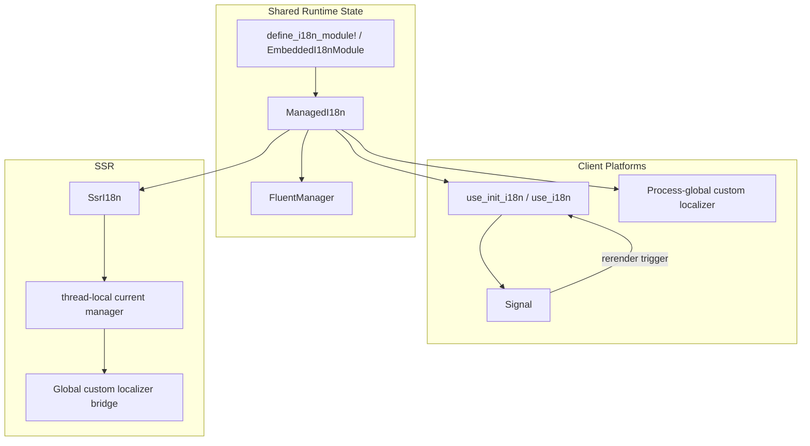

# es-fluent-manager-dioxus Architecture

This document details the architecture of the `es-fluent-manager-dioxus`
crate, which integrates `es-fluent` with Dioxus 0.7.5.

## Overview

The crate is split by rendering model instead of pretending every Dioxus target
has identical runtime needs:

- `web`, `desktop`, and `mobile` share a client runtime built around embedded
  assets, a Dioxus hook/context bridge, and a process-global `es-fluent`
  custom localizer.
- `desktop` and `mobile` intentionally share the same client implementation
  because Dioxus 0.7.5 routes both through `dioxus-desktop`.
- `ssr` is separate and uses a request-scoped thread-local bridge around
  synchronous `dioxus::ssr` rendering instead of a long-lived client signal.

Within this workspace, the implementation depends on the same 0.7.4
`dioxus-core`/`dioxus-hooks`/`dioxus-signals`/`dioxus-ssr` subcrates that sit
under Dioxus 0.7.5, instead of depending on the `dioxus` umbrella crate
directly. That avoids the current workspace resolver conflict between
`dioxus-desktop`'s `cocoa ^0.26.1` requirement and the existing GPUI pin to
`cocoa =0.26.0`.

## Architecture

## Key Pieces

### `ManagedI18n`

This is the framework-agnostic state holder.

- Builds a strict `FluentManager` from discovered modules.
- Selects the active language.
- Exposes direct message lookup helpers.
- Installs the process-global `es-fluent` custom localizer bridge when a
  frontend runtime wants derived `to_fluent_string()` calls to work.

### Client Hook Bridge

The `web`, `desktop`, and `mobile` surfaces all reuse the same hook-based
runtime:

- `use_init_i18n(...)` builds `ManagedI18n`, installs the custom localizer, and
  provides a Dioxus context.
- `DioxusI18n` mirrors the active locale into a Dioxus `Signal`, so render code
  can subscribe to locale changes.
- `localize(...)` and `use_localized(...)` intentionally read that signal before
  delegating to `es-fluent`, which is what makes locale changes rerender the UI.

Plain `to_fluent_string()` still works once the bridge is installed, but it does
not subscribe the current component to locale changes by itself.

### SSR Bridge

SSR cannot reuse the client hook model because there is no persistent client
signal and the process may render multiple requests concurrently.

The SSR module therefore:

- installs a single custom localizer bridge that looks up the current manager
  from thread-local state,
- pushes the active `ManagedI18n` manager onto that thread-local stack for the
  duration of one render call,
- runs synchronous `dioxus::ssr` rendering while derived `es-fluent` calls
  resolve through that request-scoped manager.

This keeps SSR separate from the client lifecycle while still reusing the same
module discovery and language-selection logic.
