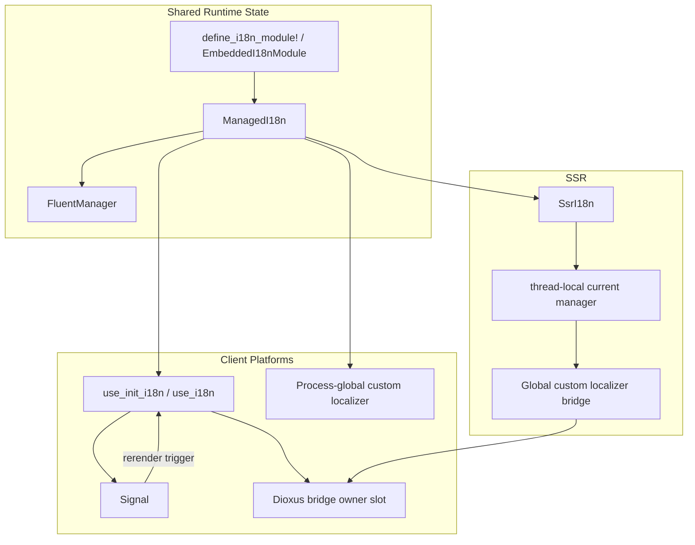

# es-fluent-manager-dioxus Architecture

This document details the architecture of the `es-fluent-manager-dioxus`
crate, which integrates `es-fluent` with Dioxus 0.7.

## Overview

The crate is split by rendering model instead of pretending every Dioxus target
has identical runtime needs:

- `web`, `desktop`, and `mobile` share a client runtime built around embedded
  assets, a Dioxus hook/context bridge, and a process-global `es-fluent`
  custom localizer.
- `desktop` and `mobile` intentionally share the same client implementation
  because Dioxus 0.7 routes both through `dioxus-desktop`.
- `ssr` is separate and uses a request-scoped thread-local bridge around
  synchronous `dioxus::ssr` rendering instead of a long-lived client signal.

Within this workspace, the implementation depends on the same 0.7
`dioxus-core`/`dioxus-hooks`/`dioxus-signals`/`dioxus-ssr` subcrates that sit
under Dioxus 0.7, instead of depending on the `dioxus` umbrella crate
directly. That avoids the current workspace resolver conflict between
`dioxus-desktop`'s `cocoa ^0.26.1` requirement and the existing GPUI pin to
`cocoa =0.26.0`.

## Architecture

## Key Pieces

### `ManagedI18n`

This is the framework-agnostic state holder.

- Builds a strict `FluentManager` from discovered modules.
- Selects the active language.
- Exposes direct message lookup helpers.
- Installs the process-global `es-fluent` custom localizer bridge when a
  frontend runtime wants derived `to_fluent_string()` calls to work.

Language selection through `select_language(...)` uses the core manager's
best-effort policy: if at least one module accepts a locale, modules that report
`LanguageNotSupported` are skipped. `active_language()` therefore records the
requested UI language, not a guarantee that every module can localize in that
language. `select_language_strict(...)` exposes the core strict policy for code
that requires all modules to accept the same locale.

The string-returning lookup helpers are rendering-oriented and fall back to the
message id on misses. `try_localize(...)` and `try_localize_in_domain(...)`
preserve the core manager's `Option<String>` result for strict callers and
tests.

`manager()` intentionally exposes the underlying `Arc<FluentManager>` as an
escape hatch. It is not part of the tracked language path: direct calls to
`FluentManager::select_language(...)` can change lookup results without updating
`ManagedI18n::active_language()` or a Dioxus signal.

### Client Hook Bridge

The `web`, `desktop`, and `mobile` surfaces all reuse the same hook-based
runtime:

- `use_init_i18n(...)` builds `ManagedI18n`, installs the custom localizer, and
  provides a generic Dioxus reactive context around it.
- `use_try_init_i18n(...)` and `use_try_provide_i18n_with_mode(...)` expose the
  same hook path without panicking on module discovery, language selection, or
  global bridge installation errors.
- The client runtime uses one reusable internal pattern: a context value that
  stores framework state plus a tracked `Signal` snapshot derived from that
  state.
- `DioxusI18n` is a thin wrapper over that generic reactive context, with the
  active locale mirrored into a Dioxus `Signal` so render code can subscribe to
  locale changes.
- `localize(...)` and `use_localized(...)` intentionally read that signal before
  delegating to the process-global `es-fluent` `ToFluentString` path, which is
  what makes locale changes rerender the UI. These helpers are reactive but not
  context-bound after an explicit `ReplaceExisting`; direct ID/domain helpers
  use the `ManagedI18n` stored in the Dioxus context.

Plain `to_fluent_string()` still works once the bridge is installed, but it does
not subscribe the current component to locale changes by itself.
The bridge is process-global. A single internal `InstalledBridge` state stores
both the active owner and any retained client manager, so ownership changes and
manager retention are updated under the same lock. Client owners are identified
by the `Arc<FluentManager>` inside `ManagedI18n`, so clones of the same manager
can reinstall or reuse the bridge without becoming a distinct owner.
`ErrorIfAlreadySet` and `ReuseIfSameOwner` reject distinct owners;
`ReplaceExisting` is the only mode that transfers ownership. When SSR replaces a
client bridge, the retained client manager is dropped from the installed bridge
state.

While a Dioxus bridge owns the process-global localizer, lookup misses are
authoritative: the bridge returns the message id instead of `None`, preventing
an unrelated global `es-fluent` context from masking missing Dioxus
translations.

### SSR Bridge

SSR cannot reuse the client hook model because there is no persistent client
signal and the process may render multiple requests concurrently.

The SSR module therefore:

- installs a custom localizer bridge that looks up the current manager from
  thread-local state, using an idempotent default path so repeated request
  constructors do not fail after the first request while SSR still owns the
  global bridge,
- pushes the active `ManagedI18n` manager onto that thread-local stack for the
  duration of one render call,
- runs synchronous `dioxus::ssr` rendering while derived `es-fluent` calls
  resolve through that request-scoped manager.

`rebuild_and_render(...)` is the safe SSR convenience path because localization
often happens during the Dioxus rebuild pass. The lower-level
`render(&VirtualDom)` and `pre_render(&VirtualDom)` methods only scope the final
serialization step and assume the caller already rebuilt the `VirtualDom` inside
`with_manager(...)`.

This keeps SSR separate from the client lifecycle while still reusing the same
module discovery and language-selection logic.

When client and SSR features are enabled together, the owner slot prevents the
two bridges from silently replacing each other. Mixed-mode examples and tests
may use `ReplaceExisting` deliberately; normal application code should choose
one active bridge owner per process.
