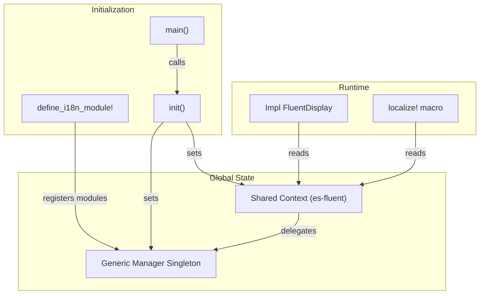

# es-fluent-manager-embedded Architecture

This document details the architecture of the `es-fluent-manager-embedded` crate, which provides a simple, zero-setup runtime for localized applications.

## Overview

`es-fluent-manager-embedded` is designed for CLI tools, desktop apps, and servers where:

- Localization files should be bundled into the single binary executable.
- Hot-reloading is not required.
- Global state access is preferred (via `once_cell` / `std::sync`).

## Architecture



## Global Singleton

The crate manages a static `GENERIC_MANAGER` using `OnceLock`.

```rust
static GENERIC_MANAGER: OnceLock<Arc<RwLock<FluentManager>>> = OnceLock::new();
```

Calls to `init()`:

1. Discover all registered modules (using `inventory`).
1. Initialize the manager.
1. Register it as the global context provider for `es-fluent`.

This enables the use of `es_fluent::localize!` anywhere in the application code without passing a manager context around.

## Usage

```rust
// In your library/crate root
es_fluent_manager_embedded::define_i18n_module!();

// In main.rs
fn main() {
    es_fluent_manager_embedded::init();
    es_fluent_manager_embedded::select_language("en-US");

    println!("{}", MyMessage { ... }); // Automatically localized
}
```
