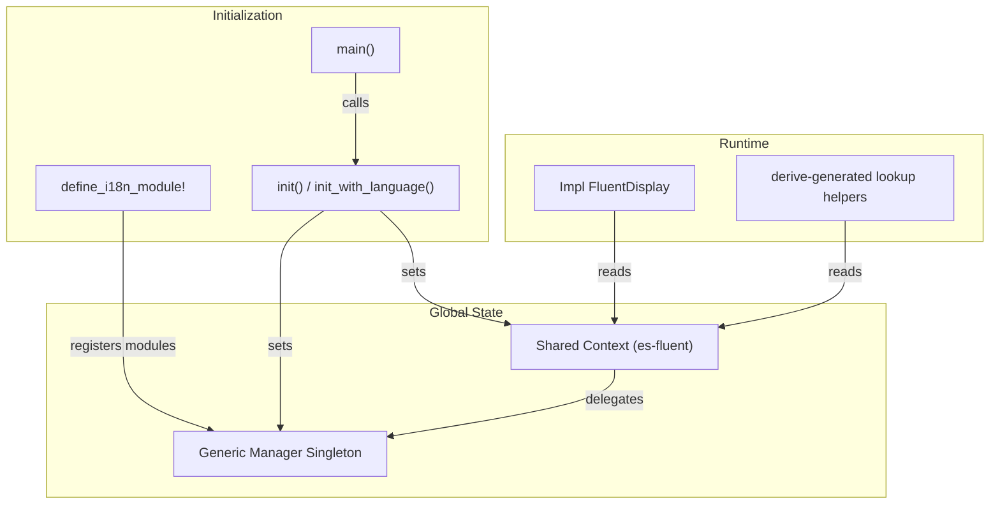

# es-fluent-manager-embedded Architecture

This document details the architecture of the `es-fluent-manager-embedded` crate, which provides a simple, zero-setup runtime for localized applications.

## Overview

`es-fluent-manager-embedded` is designed for CLI tools, desktop apps, and servers where:

- Localization files should be bundled into the single binary executable.
- Hot-reloading is not required.
- Global state access is preferred through the shared singleton.

## Architecture


```mermaid
flowchart TD
    subgraph INIT["Initialization"]
        MACRO["define_i18n_module!"]
        MAIN["main()"]
        INIT_FN["init() / init_with_language()"]
    end

    subgraph GLOBAL["Global State"]
        MGR["Generic Manager Singleton"]
        CTX["Shared Context (es-fluent)"]
    end

    subgraph RUNTIME["Runtime"]
        Display["Impl FluentDisplay"]
        Localize["derive-generated lookup helpers"]
    end

    MACRO -->|registers modules| MGR
    MAIN -->|calls| INIT_FN
    INIT_FN -->|sets| MGR
    INIT_FN -->|sets| CTX
    Display -->|reads| CTX
    Localize -->|reads| CTX
    CTX -->|delegates| MGR
```

## Global Singleton

The crate manages a static `GENERIC_MANAGER` using `OnceLock` with `ArcSwap` for lock-free reads.

```rs
static GENERIC_MANAGER: OnceLock<ArcSwap<FluentManager>> = OnceLock::new();
```

Using `ArcSwap` instead of `Arc<RwLock<...>>` enables lock-free access to the manager during localization calls, which is ideal for the read-heavy, write-rare pattern of i18n lookups.

Calls to `init()` or `init_with_language()`:

1. Discover all registered modules (using `inventory`).
1. Initialize the manager.
1. Optionally select the initial language.
1. Register it as the global context provider for `es-fluent`.

For namespaced modules, namespace files are the canonical per-locale resources.
`{domain}.ftl` is not part of the canonical resource plan when namespaces are present.

This enables derive-generated `to_fluent_string()` lookups anywhere in the application code without passing a manager context around.

## Macro

The `define_i18n_module!` macro is re-exported from `es-fluent-manager-macros::define_embedded_i18n_module`. See the [es-fluent-manager-macros architecture](../../es-fluent-manager-macros/docs/ARCHITECTURE.md) for details on how the macro discovers languages and generates module data.

This macro requires the `macros` feature, which is enabled by default.

## Initialization Behavior

The initialization entry points are idempotent for manager setup:

- `init()`
  Uses strict discovery and logs initialization failures instead of
  returning them.
- `try_init()`
  Uses strict discovery and returns a `Result`.
- `init_with_language()`
  Uses strict discovery, selects the requested language before publication,
  applies the language to the live manager on repeated calls, and logs
  initialization failures instead of returning them.
- `try_init_with_language()`
  Uses the strict discovered-manager path, selects the requested language
  before publication, and returns any initialization error.

`select_language()` returns an error if initialization was skipped or if no
discovered module can serve the requested locale. When some modules support the
requested locale and others do not, the default switch keeps the supporting
modules active.

## Usage

```rs
// In your library/crate root
es_fluent_manager_embedded::define_i18n_module!();

// In main.rs
fn main() {
    es_fluent_manager_embedded::init_with_language(unic_langid::langid!("en-US"));

    println!("{}", MyMessage { ... }); // Automatically localized
}
```

If the language is not known at startup, call `init()` first and
`select_language(...)` later.
