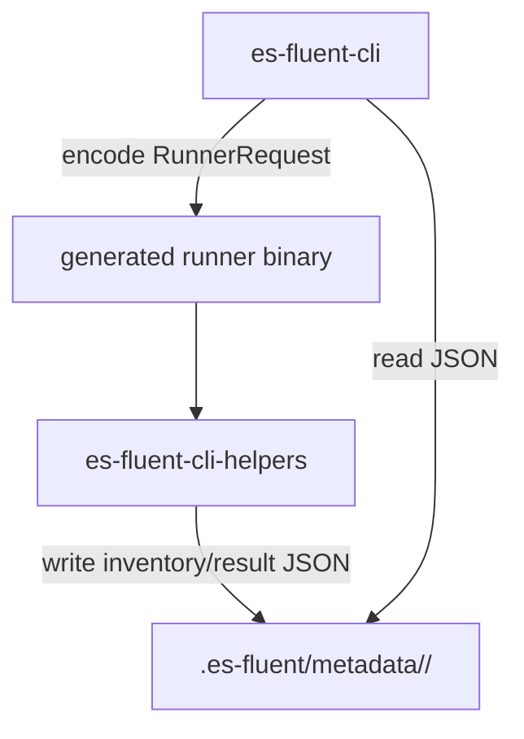

# es-fluent-runner Architecture

`es-fluent-runner` is the shared protocol crate for the temporary `.es-fluent/`
workspace created by `es-fluent-cli`.

## Purpose

This crate keeps the boundary between the CLI host process and the generated
runner binary small and explicit. It owns:

1. Serialized requests sent into the runner (`RunnerRequest`, `RunnerParseMode`)
1. Serialized outputs written by runner-backed commands (`RunnerResult`,
   `InventoryData`, `ExpectedKey`)
1. Filesystem conventions for `.es-fluent/metadata/{crate}/...`
1. Small helpers such as locale-directory discovery

## Data Flow



The CLI serializes a `RunnerRequest` and passes it to the generated binary as a
single argument. The binary forwards that request to `es-fluent-cli-helpers`,
which performs the requested action and writes metadata back to disk using the
paths defined in this crate.

## Protocol Surface

### `RunnerRequest`

The runner currently supports three commands:

- `Generate`: generate or update fallback-locale FTL files, carrying
  `RunnerParseMode` and dry-run intent from the CLI
- `Clean`: remove generated keys and stale namespace files in the generator
  clean flow, with fallback-only or all-locale scope controlled by the request
- `Check`: collect expected keys, variables, and optional Rust source locations
  from inventory

### Output Types

- `RunnerResult` stores whether a generate/clean action changed anything
- `InventoryData` stores the expected message keys for `check`
- `ExpectedKey` records the message key, variables, and optional source location

## Filesystem Layout

```text
.es-fluent/
└── metadata/
    └── {crate_name}/
        ├── inventory.json
        └── result.json
```

The helper functions in this crate are the canonical way to read or write these
paths. That keeps the on-disk layout stable across `es-fluent-cli` and
`es-fluent-cli-helpers`.

## Boundary

`es-fluent-runner` deliberately does not:

- inspect Rust code
- generate or clean `.ftl` files
- validate translations
- manage runner staleness or Cargo invocation

That logic lives in `es-fluent-cli` and `es-fluent-cli-helpers`. This crate only
owns the wire format and filesystem conventions that connect them.
