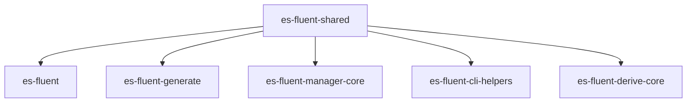

# es-fluent-shared Architecture

`es-fluent-shared` holds the **runtime-safe shared surface** for the `es-fluent` workspace. It exists to prevent build-time macro plumbing from becoming the de facto dependency root for crates that only need common metadata or helpers.

## Purpose

This crate centralizes reusable pieces that are needed by multiple layers:

1. **Registry Metadata**: `FtlTypeInfo`, `FtlVariant`, `NamespaceRule`, and `TypeKind`.
1. **Common Errors**: `EsFluentError` / `EsFluentResult` for filesystem, config, and language-discovery workflows.
1. **Naming Helpers**: `FluentKey`, `FluentDoc`, and tuple-field naming utilities.
1. **Path and Locale Helpers**: asset-directory validation and locale directory parsing.

## Architecture Role

- `es-fluent` re-exports registry and meta types from this crate.
- `es-fluent-generate` uses it to reason about registered message metadata without depending on derive parsing.
- `es-fluent-manager-core` uses the shared error surface for runtime-localization operations.
- `es-fluent-cli-helpers` uses shared errors and metadata when running inside generated runner crates.
- `es-fluent-derive-core` now builds macro parsing and validation on top of this crate instead of also owning these shared types.

## Modules

### `error.rs`

Shared non-proc-macro error types used by runtime and tooling code.

### `meta.rs`

Defines `TypeKind`, which classifies registered types (`Struct` vs `Enum`).

### `registry.rs`

Defines inventory-facing metadata:

- `FtlVariant`
- `FtlTypeInfo`
- namespace resolution for registered types

### `namespace.rs`

Defines `NamespaceRule`, including literal, file-based, and folder-based namespace strategies.

### `namer.rs`

Contains reusable naming primitives such as:

- `FluentKey`
- `FluentDoc`
- `UnnamedItem`

### `path_utils.rs`

Contains shared filesystem helpers for:

- validating asset directories
- parsing canonical locale directory entries into `LanguageIdentifier`

## Boundary

`es-fluent-shared` should stay free of proc-macro-only behavior. Macro parsing, `darling` option trees, and compiler-diagnostic helpers belong in `es-fluent-derive-core`. Runtime-safe metadata and helpers belong here.
