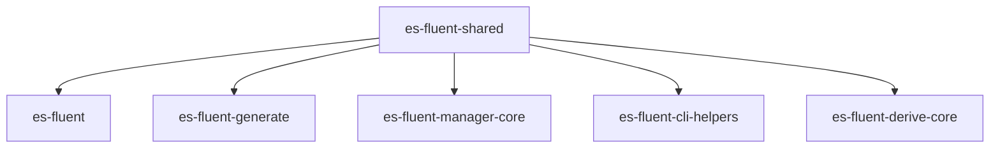

# es-fluent-shared Architecture

`es-fluent-shared` holds the **runtime-safe shared surface** for the `es-fluent` workspace. It exists to prevent build-time macro plumbing from becoming the de facto dependency root for crates that only need common metadata or helpers.

## Purpose

This crate centralizes reusable pieces that are needed by multiple layers:

1. **Registry Metadata**: `FtlTypeInfo`, `FtlVariant`, `NamespaceRule`, and `TypeKind`.
1. **Common Errors**: `EsFluentError` / `EsFluentResult` for filesystem, config, and language-discovery workflows.
1. **Fluent Identifiers**: validated message IDs, argument names, variant keys, and domains shared by derive and tooling layers.
1. **Naming Helpers**: `FluentKey`, `FluentDoc`, and tuple-field naming utilities.
1. **Path and Locale Helpers**: asset-directory validation and locale directory parsing.
1. **Resource Planning**: `ResourceKey`, `ModuleResourceSpec`, and canonical resource-plan helpers shared by manager and tooling crates.

## Architecture Role

- `es-fluent` re-exports registry and meta types from this crate.
- `es-fluent-generate` uses it to reason about registered message metadata without depending on derive parsing.
- `es-fluent-manager-core` uses the shared error surface for runtime-localization operations.
- `es-fluent-cli-helpers` uses shared errors and metadata when running inside generated runner crates.
- `es-fluent-derive-core` now builds macro parsing and validation on top of this crate instead of also owning these shared types.

## Modules

### `error.rs`

Shared non-proc-macro error types used by runtime and tooling code.

### `meta.rs`

Defines `TypeKind`, which classifies registered types (`Struct` vs `Enum`).

### `fluent.rs`

Defines shared validated Fluent string newtypes:

- `FluentMessageId`
- `FluentEntryId`
- `FluentArgumentName`
- `FluentVariantKey`
- `FluentDomain`

These types enforce the common ASCII identifier-like grammar once.
`FluentEntryId` additionally accepts term IDs with a leading `-`, for tooling
paths that operate on arbitrary Fluent entries instead of only messages.
Proc-macro crates wrap validation failures with spans and attribute context;
runtime and tooling crates can use the same constructors without depending on
macro diagnostic machinery.

### `registry.rs`

Defines inventory-facing metadata:

- `FtlVariant`
- `FtlTypeInfo`
- namespace resolution for registered types

`FtlVariant` keeps the static inventory ABI as string slices, but exposes typed
accessors for validated entry IDs, message IDs, argument names, and source
lines.
`FtlTypeInfo` exposes typed source-file/source-location helpers and resolves
namespace rules into `ResolvedNamespace` before tooling uses them for paths.

### `namespace.rs`

Defines `NamespaceRule`, including literal, file-based, and folder-based namespace strategies.

### `resource.rs`

Defines shared resource-planning primitives:

- `ResourceKey`
- `LocaleRelativeFtlPath`
- `ModuleResourceSpec`
- `ResourcePlanError`
- canonical base/namespaced resource planning
- sparse asset-tree discovery for compile-time manager module manifests
- required/optional resource-key set helpers

`ResourceKey` validates the canonical `{domain}` or `{domain}/{namespace}`
shape, and `ModuleResourceSpec` carries `ResourceKey` plus
`LocaleRelativeFtlPath` rather than raw strings. This keeps manager macros,
manager-core, and generation tooling on one constructor path for resource
identity and locale-relative file paths.

Use `try_resource_plan_for` for dynamic planning paths that need typed
namespace failures. `resource_plan_for` is a panic wrapper for static metadata
paths where invalid namespaces are programmer errors.
Use `ResourcePlan::sparse_from_assets` when compile-time macro code needs to
turn an `i18n.toml` assets directory into canonical supported languages,
namespace metadata, and per-language `ModuleResourceSpec` lists.

### `namer.rs`

Contains reusable naming primitives such as:

- `FluentKey`
- `FluentDoc`
- `UnnamedItem`

### `path_utils.rs`

Contains shared filesystem helpers for:

- validating asset directories
- parsing canonical locale directory entries into `LanguageIdentifier`

## Boundary

`es-fluent-shared` should stay free of proc-macro-only behavior. Macro parsing, `darling` option trees, and compiler-diagnostic helpers belong in `es-fluent-derive-core`. Runtime-safe metadata and helpers belong here.
