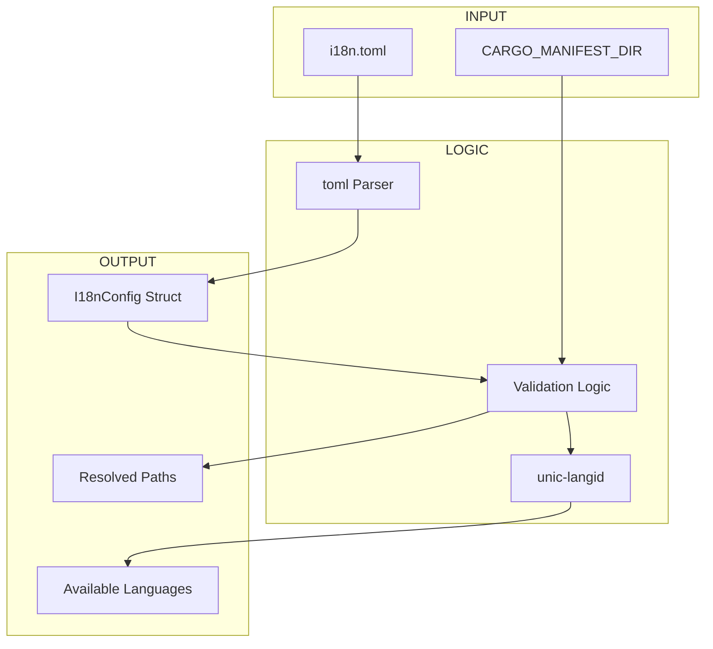

# es-fluent-toml Architecture

This document details the architecture of the `es-fluent-toml` crate, which provides configuration management for the `es-fluent` ecosystem.

## Overview

`es-fluent-toml` is the single source of truth for project configuration. It is responsible for parsing `i18n.toml` and resolving environment-agnostic paths (like asset directories) into absolute paths that other crates can use.

## Architecture

The crate defines the schema for configuration and validation logic.



## Configuration Schema

```toml
# Default fallback language (required)
fallback_language = "en-US"

# Path to FTL assets relative to the config file (required)
assets_dir = "assets/locales"

# Optional features to enable in generated code
fluent_feature = ["my-feature"]
```

## Key Responsibilities

1.  **Path Resolution**:
    It resolves `assets_dir` relative to the `i18n.toml` location (usually the workspace root), ensuring that CLI tools and build scripts (proc-macros) see the same path regardless of their Current Working Directory.

2.  **Language Discovery**:
    It scans the `assets_dir` to find all subdirectories that correspond to valid BCP-47 language codes. This allows the ecosystem to auto-discover available languages without manual registration.

3.  **Validation**:
    It ensures that paths exist and that language codes are spec-compliant (e.g., rejecting invalid BCP-47 tags).
