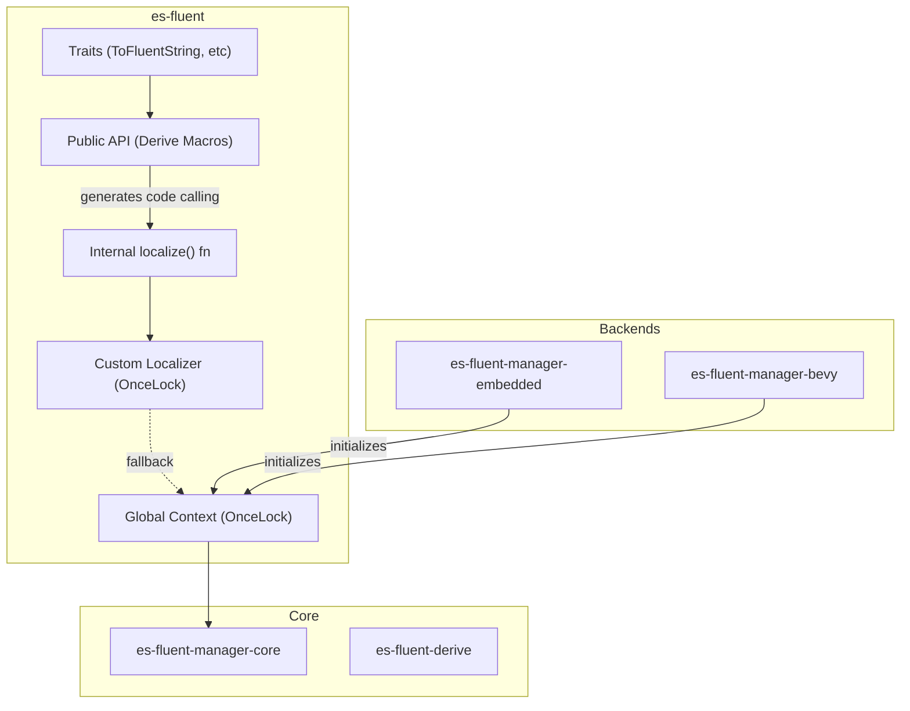

# es-fluent Architecture

This document details the architecture of the `es-fluent` crate, which serves as the user-facing facade and entry point for the ecosystem.

## Overview

`es-fluent` ties together the core components (`core`, `derive`, `manager`) into a cohesive API. It provides:

1. **Re-exports**: Easy access to common traits (`EsFluent`, `EsFluentChoice`, `EsFluentKv`, `EsFluentThis`, `ToFluentString`, `ThisFtl`) and derive macros.
1. **Global Context**: A thread-safe singleton for storing the `FluentManager`, enabling ergonomic localization macros.
1. **Custom Localizer**: A hook for overriding or intercepting the localization process.
1. **Traits**: Standard definitions for how types invoke the localization system.

## Architecture



## Global Context

To allow `Display` implementations (which can't easily pass arguments) to access translations, `es-fluent` uses a `OnceLock`-protected global context.

```rs
static CONTEXT: OnceLock<Arc<RwLock<FluentManager>>> = OnceLock::new();
```

- **Initialization**: Only one backend (e.g., `embedded::init()` or `bevy` plugin) can initialize this context using `set_context` or `set_shared_context`.
- **Updates**: The context can be modified at runtime using `update_context`.
- **Consumption**: The internal `localize` function (used by the `FluentDisplay` trait) acquires a read lock on this context to format strings.

## Custom Localizer

A custom localizer can be registered to intercept translation requests. This is useful for testing, special environments, or implementing fallbacks.

```rs
static CUSTOM_LOCALIZER: OnceLock<Box<dyn Fn(...) -> Option<String> ...>> = OnceLock::new();
```

- **Priority**: The `localize` function first checks the custom localizer. If it returns `Some(string)`, that result is used.
- **Fallback**: If the custom localizer returns `None` (or isn't set), the system falls back to the Global Context.

## Traits

> **Important**: All traits listed below are intended to be implemented automatically by `#[derive(EsFluent)]` or other macros. **Manual implementation is strongly discouraged** and rarely needed (except for wrapping enums that delegate to other derived types).

### `ToFluentString`

The primary trait for converting a type into a localized string.

### `FluentDisplay`

A helper trait that `#[derive(EsFluent)]` implements. It handles the logic of looking up the correct key and passing arguments to the `localize` function.

### `EsFluentChoice`

Used to convert an enum into a string that can be used as a Fluent choice (selector).

### `ThisFtl`

A trait for types that have a "this" fluent key representing the type itself, typically implemented via `#[derive(EsFluent)]` with `#[fluent(this)]`.

## Integration

Users generally add this crate to their dependencies:

```toml
[dependencies]
es-fluent = { version = "...", features = ["derive"] }
```

And then use the derive macros:

```rs
use es_fluent::{EsFluent, EsFluentChoice, EsFluentKv, EsFluentThis};

#[derive(EsFluent)]
struct Hello;

#[derive(EsFluentKv)]
#[fluent_kv(keys = ["label", "placeholder"])]
struct MyForm {
    username: String,
    password: String,
}

#[derive(EsFluentThis)]
#[fluent_this(origin)]
enum Gender {
    Male,
    Female,
}
```

> **Note**: Consumers should rely on the `#[derive(EsFluent)]` macro and the `ToFluentString` trait. The trait only needs to be in scope to enable calling `to_fluent_string`. Direct usage of the internal `localize!` macro or function is discouraged and generally not necessary.
