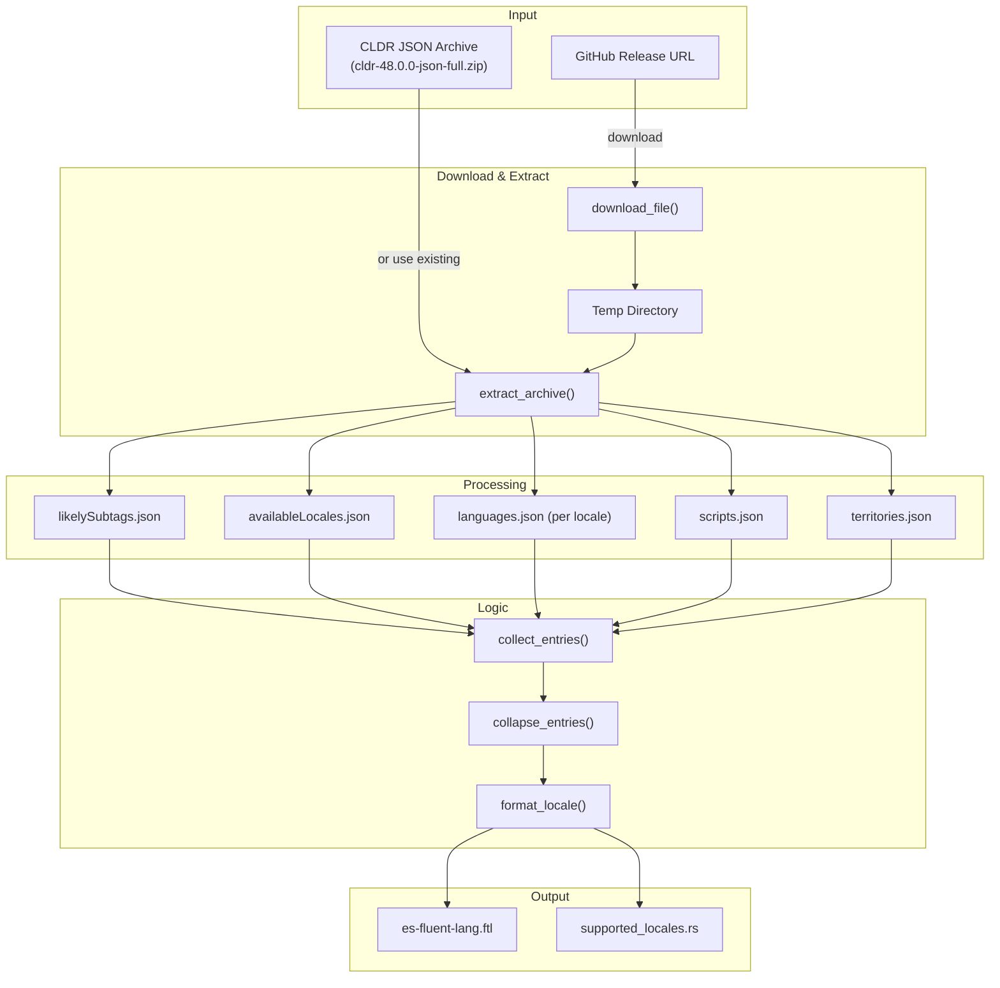

# cldr-es-fluent-lang Architecture

This document details the architecture of the `cldr-es-fluent-lang` script, which generates language name data for the es-fluent ecosystem.

## Overview

The script processes Unicode CLDR (Common Locale Data Repository) JSON data to extract language autonyms (self-names) and generates both Fluent translation files and Rust source files for compile-time validation.

## Architecture



## Data Flow

### 1. CLDR Data Acquisition

The script uses CLDR release 48.0.0 by default. It can either:
- Download the archive from GitHub releases
- Use a pre-existing local archive (via `--cldr-zip`)

### 2. Locale Parsing

The `Locale` dataclass parses BCP-47 language tags into components:

### 3. Entry Collection

For each available locale in CLDR:

1. **Expand locale** using `likelySubtags.json` (e.g., `zh` -> `zh-Hans-CN`)
2. **Generate candidate keys** for lookup (full tag, lang-script, lang-region, base language)
3. **Fallback chain** lookup for autonym:
   - Try the locale's own `languages.json`
   - Fall back through parent locales (e.g., `en-US` -> `en` -> `root`)
   - Fall back to English names
4. **Construct display name** from components if no autonym found

### 4. Entry Collapsing

The `collapse_entries()` function deduplicates entries where multiple region variants share the same name:

| Before | After |
|--------|-------|
| `en-US = English`, `en-GB = English`, `en-AU = English` | `en = English` |
| `zh-Hans-CN = 简体中文`, `zh-Hans-SG = 简体中文` | `zh-Hans = 简体中文` |

This reduces file size while preserving distinct names for locales that differ.

### 5. Locale Formatting

The `format_locale()` function normalizes output tags:

- Drops implicit scripts (e.g., `en-Latn` -> `en` since Latin is default for English)
- Drops `001` (World) region when implicit
- Preserves scripts when they differ from the likely default

## Key Functions

| Function | Purpose |
|----------|---------|
| `download_file()` | Downloads CLDR archive with progress bar |
| `extract_archive()` | Extracts ZIP with progress bar |
| `Locale.parse()` | Parses BCP-47 tags into components |
| `expand_locale()` | Expands minimal tags using likelySubtags |
| `fallback_chain()` | Generates locale fallback sequence |
| `candidate_language_keys()` | Generates lookup keys for autonym search |
| `collect_entries()` | Main processing loop for all locales |
| `collapse_entries()` | Deduplicates entries with identical names |
| `format_locale()` | Normalizes output locale tags |
| `write_ftl()` | Writes Fluent translation file |
| `write_supported_locales()` | Writes Rust constant array |

## Output Files

### es-fluent-lang.ftl

Located at `crates/es-fluent-lang/es-fluent-lang.ftl`:

```ftl
es-fluent-lang-aa = Afar
es-fluent-lang-ab-GE = Аԥсшәа
es-fluent-lang-af = Afrikaans
es-fluent-lang-agq-CM = Aghem
es-fluent-lang-ak-GH = Akan
es-fluent-lang-am-ET = አማርኛ
es-fluent-lang-an-ES = aragonés
es-fluent-lang-ann-NG = Obolo
# ...
```

Keys are prefixed with `es-fluent-lang-` to namespace them within the Fluent ecosystem.

### supported_locales.rs

Located at `crates/es-fluent-lang-macro/src/supported_locales.rs`:

```rs
pub const SUPPORTED_LANGUAGE_KEYS: &[&str] = &[
    "aa",
    "ab-GE",
    "af",
    "agq-CM",
    "ak-GH",
    "am-ET",
    "an-ES",
    "ann-NG",
    // ...
];
```

This constant is used by `es-fluent-lang-macro` to validate language directories at compile time.

## Dependencies

- `requests` - HTTP downloads
- `typer` - CLI framework
- `tqdm` - Progress bars
