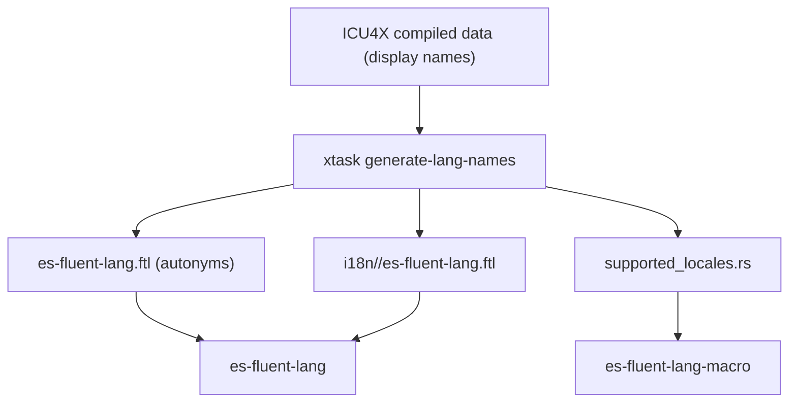

# xtask Architecture

This document describes the `xtask` crate used for repository maintenance
automation.

## Overview

`xtask` centralizes generation of bundled language-name data from ICU4X compiled
display-name resources.

Current command:

- `generate-lang-names`

## Responsibilities

`generate-lang-names` performs three coordinated outputs:

1. Generates autonyms into `crates/es-fluent-lang/es-fluent-lang.ftl`.
1. Generates localized language-name files into
   `crates/es-fluent-lang/i18n/<locale>/es-fluent-lang.ftl`.
1. Generates compile-time locale keys into
   `crates/es-fluent-lang-macro/src/supported_locales.rs`.

## Data Flow

## Notes

- Locale discovery is based on ICU4X markers shared across language/locale/region/script/variant display-name datasets.
- Output locales are filtered to locales with usable formatter data.
- Locale-name fallback favors exact match, then parent locale, then English, then first available locale.
