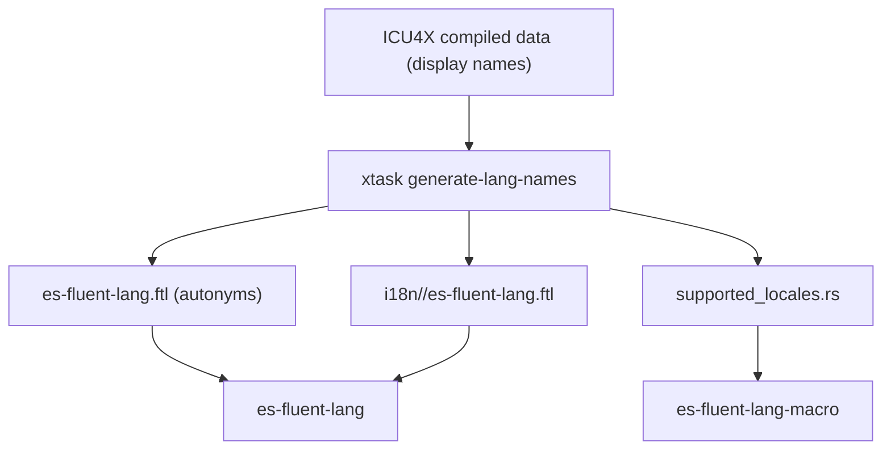

# Architecture: xtask

## Purpose

`xtask` provides workspace maintenance tasks for this project.

## CLI commands

- `generate-lang-names`: Generates language-name resources and `supported_locales.rs` from ICU4X data
- `build-book`: builds mdBook documentation to `web/public/book`.
- `build-llms-txt`: concatenates mdBook sources into `web/public/llms.txt` for LLM consumption.

### generate-lang-names

#### Responsibilities

`generate-lang-names` performs three coordinated outputs:

1. Generates autonyms into `crates/es-fluent-lang/es-fluent-lang.ftl`.
1. Generates localized language-name files into
   `crates/es-fluent-lang/i18n/<locale>/es-fluent-lang.ftl`.
1. Generates compile-time locale keys into
   `crates/es-fluent-lang-macro/src/supported_locales.rs`.

#### Data Flow

#### Notes

- Locale discovery is based on ICU4X markers shared across language/locale/region/script/variant display-name datasets.
- Output locales are filtered to locales with usable formatter data.
- Locale-name fallback favors exact match, then parent locale, then English, then first available locale.

### build-book

- `xtask/src/commands/build_book.rs`: invokes `mdbook build` with output to `web/public/book`, adds `.gitignore` to exclude built files from version control.

### build-llms-txt

- `xtask/src/commands/build_llms_txt.rs`: reads `SUMMARY.md`, extracts referenced markdown files, concatenates their content with separators.
